# 实验1 初识Xinu

**截止时间：2026年4月1日23：59**

## 提交要求

- 正常提交 → OBE上“实验1”  
- 截止时间后修改后提交 → OBE上新开条目（待OBE上创建）

## 实验报告编制要求

- 文件名：==学号姓名.pdf== ←注意  
- 报告标题：体现出“实验1”等信息  
- 报告作者：==学号 姓名== ←注意  
- 不同题目之间有明显的间隔，要能够容易地区分不同题目对应的实验内容  
- 实验报告不做任何其他版式上的要求  

本次实验不要求提交代码，只需提交实验报告即可，但实验报告应说明对代码的修改（如果有），以及丰富的截图和配套的文字说明（不能只有截图而无文字说明，或只有文字而无截图）。

==建议开始之前，先查看第4部分环境搭建的内容。==

## 使用LLM

- 可以使用LLM辅助完成实验，但需在实验报告开篇明确说明使用了哪个LLM，在报告正文相应的地方仔细描述如何让LLM完成什么任务、获得了什么结果、结果是否需要人工修正、或者多轮迭代由LLM修正。建议将对话截图放到实验报告中。LLM输出太长时可以不用截完整，另外通过文字简要描述即可。  
- 如果（多轮迭代）使用LLM仍然没有获得一定程度上可用的结果（如返回结果中实际可用的部分不超过3成），则没有必要提及LLM。

---

## 实验目的

希望学生能对Xinu开发和通过QEMU运行调试操作系统内核有一个基本的掌握，为后续其他实验的开展打下基础。

## 实验要求

1. 修改Xinu代码，添加课件上并发执行的示例（“第一章引论”第22页），观察在以下各种条件下的输出，并解释该输出的成因（**在不同环境下结果可能有所不同，根据自己观察的结果进行解释即可**）。注意：特别关注最开始的一段时间内的输出（如果输出太多、刷新太快，可设置循环次数）。
   1. main函数进程与sndA、sndB进程的优先级一致；  
   2. main函数进程的优先级较低，而sndA和sndB的优先级较高且相等（调用create函数时的参数“20”即为优先级，数字越大，优先级越高）；  
   3. 注意——额外要求（需要完成）：从Xinu中寻找合适的函数，在sndA和sndB中进入while之前输出一串信息，包含学号、姓名和当前函数名（中文姓名如果显示为乱码的话，可以使用拼音）。

2. 通过QEMU调试，在合适的地方设置断点，查看相关数据，然后据此画出2.1. a 中自从进入main函数进程之后，上下文切换的流程，记录从哪个进程切换到哪个进程（从gdb中可以输出进程的名称，参看struct procent中的prname字段）、栈指针的变化（注意：与 3.7c 中的问题一并回答）。
   1. 可以在Word中画，也可以在其他工具中画然后截图，也可以手画然后拍照。对于后两种形式，在原画面（其他工具或纸张上），写上“学号姓名”，不能是截图或拍照之后在图片上添加 ←注意  
   2. 画图任务不能由LLM完成。

3. 任意选定一个进程的创建，通过调试的方式查看该进程的初始栈，观察INITRET和funcaddr在栈中的取值，并与userret和进程入口函数的实际值做对比。
   1. 实际值可通过在父进程中打印的形式输出，也可以在调试环境中获取（如在gdb中查看特定内存地址的数据）。

4. 观察确认系统中最后一个普通进程自杀或正常结束之后（需禁止掉Xinu原有的shell——如：将main函数中的代码都注释掉），系统的实际运行状态，描述此时进程状态（进程表中有哪些进程，各自状态是什么，等等）、所执行指令、当前进程的信息，提供截图+文字描述。
   1. 只需考虑普通进程优先级大于空进程即可，鼓励探索普通进程与空进程优先级相同的情况。

5. ==独立完成（可使用LLM辅助），可讨论，不能抄袭==

## 3. 实验步骤

1. 下载、编译Xinu源代码：准备好Linux编译环境（本机Linux、虚拟机安装的Linux或WSL，使用QEMU图形界面请参考4.2；不使用QEMU图形界面请参考4.3）
   1. 对于ARM版的Linux，可以参考OBE“课件”中的“在ARM版上编译Xinu”；  
   2. 对于MacOS（Intel或Mx芯片），也可以参考上述文档，或自行探索。

2. 进入源代码compile目录，运行make，如果成功生成xinu.elf，表示编译成功；如果不确定，可以先执行make clean，确保xinu.elf已被删除，再重新执行make

3. 通过QEMU运行Xinu：
   1. 执行命令：`qemu-system-i386 -kernel xinu.elf`  
   2. 在弹出的QEMU界面上按下Ctrl+Alt+3，出现如下的界面（图1），表明Xinu运行成功
      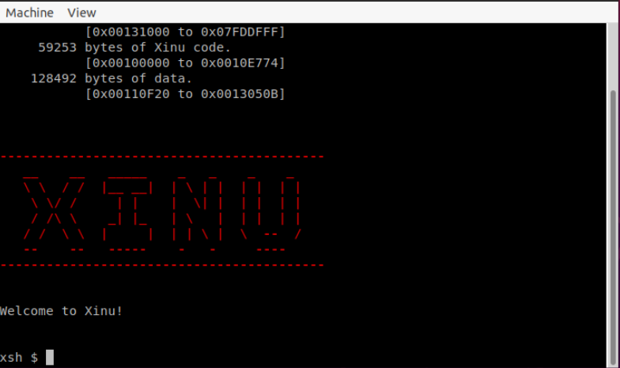

4. 实验所要求的代码修改，在 system/main.c 中进行，将原有的 main 函数体用实验要求的 main 函数实现替换，并在该文件中添加 sndA 和 sndB 的实现  

  1. main 进程的优先级在创建该进程时设置，请自行搜索代码位置

5. 修改代码后，确保重新执行 make 命令；如果修改了.h 头文件，确保先执行 make clean 在执行 make

6. 根据实验要求 2.1 修改代码，运行 Xinu 并观察输出结果

7. 对于实验要求 2.2，打开两个终端窗口，其中一个以调试方式启动 QEMU 执行 Xinu，另一个执行 gdb，设置断点及单步调试

   1. 由于要求记录从进入 main 函数进程开始的上下文切换，所以在 gdb 中设置断点为 main 函数；又因要求记录进程的变化和栈顶指针的变化，所以在 ctxsw 函数中修改 ESP 寄存器的指令处设置断点（如果需要通过 currpid 来获知切换前后的进程 ID，则应在修改其值之前设置断点）  
   2. 运行到 main 函数，暂停于断点处，在 gdb 中输入命令：`bt`，查看运行栈，此时应看到类似于如图 2 的信息：
      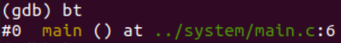

   3. 在 gdb 中输入命令：`c`，以继续执行到下一个断点，输入命令：`bt`，查看函数调用栈，推断此时所在进程，并检查此时 ESP 寄存器的值；若此时暂停在 ctxsw 中的断点处，查看 ESP 的值，然后单步执行到 ctxsw 的 ret 指令处，再执行命令：`bt`，查看函数调用栈。注意观察刚改变 ESP 寄存器后的调用栈与执行到 ret 指令处的调用栈是否有区别，如果有，思考其原因。  
   
   4. 重复 3.7 c 的操作，直到进程变化保持稳定（如永远只有进程 A 在输出，或进程 A 和进程 B 交替输出）。

## 实验说明

主要内容（建议先仔细查看本节内容，然后再开始动手实验）：

1. 构建编译环境、编译Xinu、部分编译时可能会出现的问题；

2. QEMU+GBD调试Xinu；
3. 不使用图形化界面显示Xinu（对于“键盘+显示器驱动”之外的实验均适用）；
4. 使用VNC模式启动QEMU，并通过VNC远程连接显示Xinu（适用于不能在本地使用图形化QEMU的同学）。

### Xinu编译相关说明

1. 确保已安装gcc、make、gawk、flex、bison、libfl-dev，或根据编译代码的出错信息安装缺失的依赖  
2. 首次编译代码，若出现错误类似于：“make: *** No rule to make target 'binaries/start.o', needed by './compile/xinu.elf'. Stop.”，重新执行一次make即可（不要make clean）  
3. 本实验中，为方便观察，请确保include/kernel.h中QUANTUM为一个较小的数（如2，表示时间片为2毫秒）
4. 为便于调试，在compile/Makefile中为CFLAGS赋值处，加上 `-ggdb` 选项，以便在目标文件中保留调试信息——如果编译之后有修改，然后才想起添加调试选项，则先make clean清除原来的编译结果，甚至可以删除compile目录下的两个隐藏文件`.defs`和`.deps`

### QEMU调试，以Ubuntu系统为例

1. 安装qemu: `sudo apt install qemu-system-x86`  

2. 开启两个终端窗口，在一个窗口内执行命令：`qemu-system-i386 -S -s -kernel xinu.elf`  

   - `-S`：在启动时就挂起CPU，等待gdb连接  

   - `-s`：等价于`-gdb tcp::1234`，表示打开默认的1234这个gdb调试端口，也可以通过显式使用`-gdb tcp::X`的方式指定调试端口  
   
3. 在QEMU窗口按下Ctrl+Alt+3之后，如图3所示，表明Xinu并未完成启动，在等待调试器的命令：
   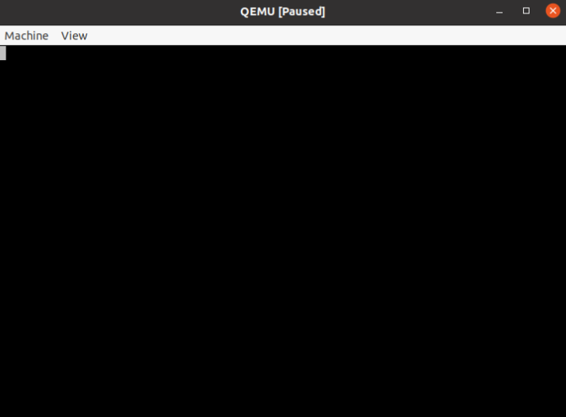

4. 在另一个终端窗口内执行命令：`gdb`，应看到类似于如图4的信息：
   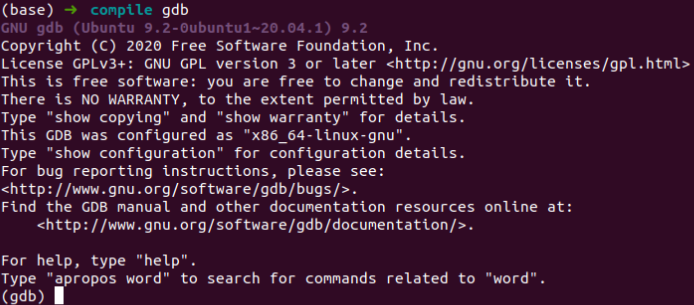

5. 输入：`target remote :1234`，可观察到如图5所示的内容  

     - 如果手动指定了调试端口X，则输入命令：`target remote :X`  
     - `:1234`等价于`localhost:1234`

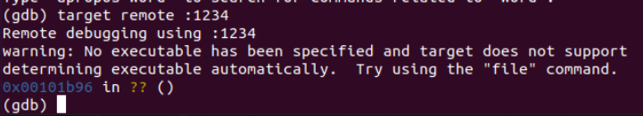

6. 在 gdb 中输入：`c`，应观察到 QEMU 能够正常显示输出，表明 Xinu 已完成启动，正常运行  
   - `c`为continue的缩写  

7. 在4.2f输入“c”之前，可先加载符号文件，即xinu.elf，便于以源码位置设置断点，命令为：`file xinu.elf`（见图6）
   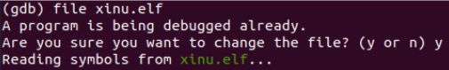

8. 加载符号文件之后，可设置断点，命令：`b main`，在main函数处设置断点（图7），然后输入命令：`c`，可观察到QEMU中运行Xinu（以原始版本为例，非实验要求修改代码后的版本）有一定输出，但并未运行到shell（图8）：  

  - 命令`bt`为backtrace的缩写

   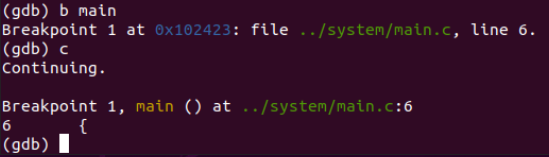
   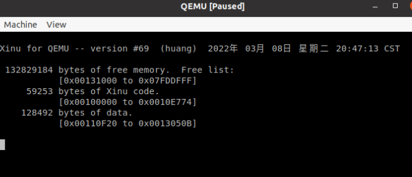

### QEMU 无图形化模式，以 WSL 中无图形化模式为例（较新的 WSL 也能支持图形化模式的 QEMU）

1. 在 WSL 中安装 qemu-system-x86  
2. 开启两个 WSL 终端，在其中一个输入命令：`qemu-system-i386 -nographic -kernel xinu.elf -nographic`：无图形化模式，标准IO定向为串口IO，其余的选项与Ubuntu下一致  
3. 在另一个WSL终端中执行gdb，具体操作参考4.2  
4. 第一个终端窗口中Xinu运行起来的效果如图9所示
   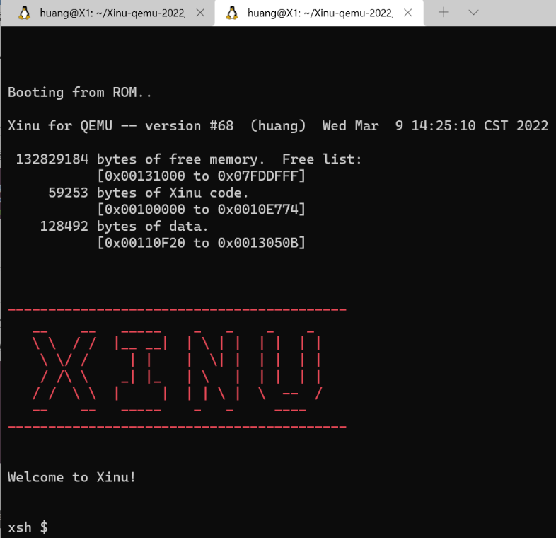

5. 在图9所示界面，可通过`Ctrl+a h`（即同时按下Ctrl键和A键，然后释放并迅速按下h），查看辅助命令，如图10所示：
   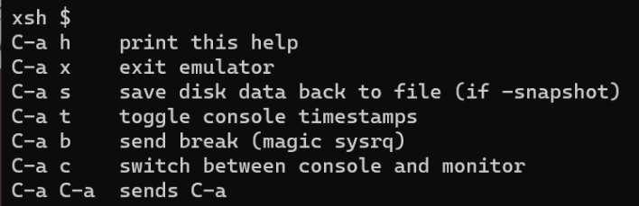

6. 按下`Ctrl+a x`，即可在非图形化模式下退出QEMU  

7. 注意：在Windows11+WSL2中，执行`qemu-system-i386 -kernel xinu.elf`，也会弹出一个QEMU窗口，如图11所示
   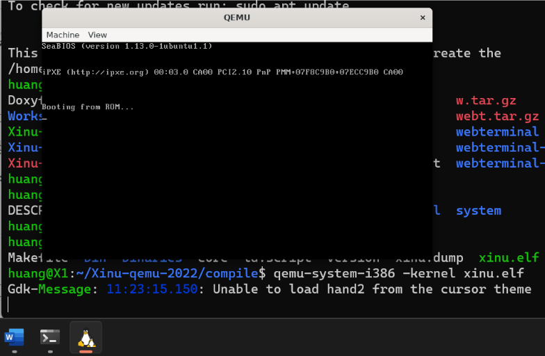

### 使用VNC

如果WSL或其他Linux环境（如远程服务器）不能提供图形界面的QEMU，可以尝试通过VNC的方式连接QEMU。

1. 以VNC启动QEMU: `qemu-system-i386 -kernel xinu.elf -vnc :2`，添加`-vnc`选项，后边的“2”表示2号显示器，也可以使用尚未被占用的其他编号（通常是一个较小的数字）  

2. 通过VNC连接，可以使用VNC Viewer或其他支持VNC的工具，然后通过`ip:2`的方式连接。其中，ip是localhost（如使用本机WSL）或远程服务器IP，2为上一步的显示器编号。效果如图12所示。  

3. 通过VNC连接时，同样可以使用调试模式，如图13所示。
   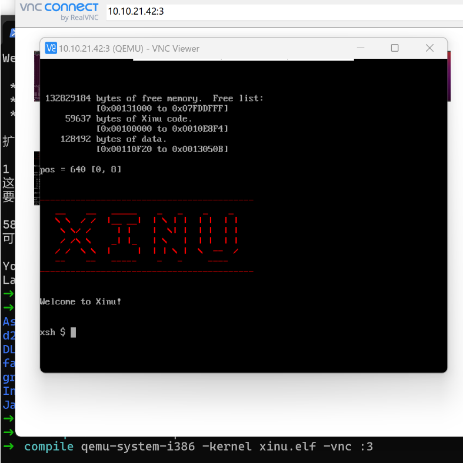

   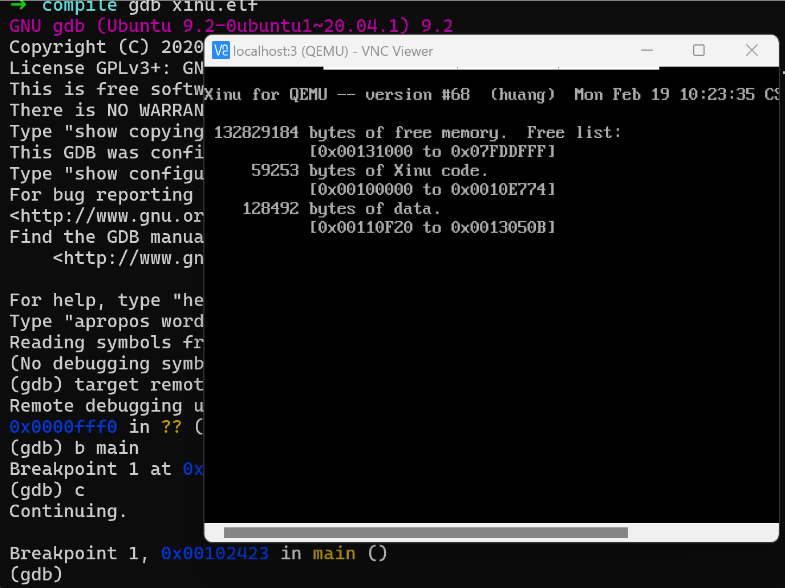

## 思维扩展

（不要求在实验报告中作答）

回顾调度与上下文切换的基本原则和流程，以及进程创建的操作和进程栈的初始化，并将其与上下文切换相联系。

仔细察看OpenHarmony中LiteOS-M和LiteOS-A的任务调度/进程调度的代码实现，描述其具体流程（也可以执行下载编译、模拟执行、调试查看，以进一步深入理解其过程）。

- https://gitcode.com/openharmony/kernel_liteos_m/blob/master/kernel/src/los_sched.c  
- https://gitcode.com/openharmony/kernel_liteos_a/blob/master/kernel/base/sched/los_sched.c