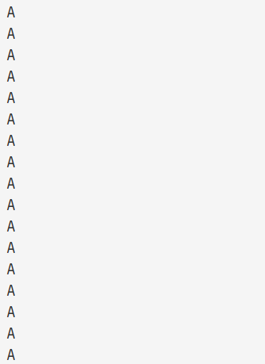
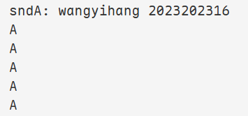
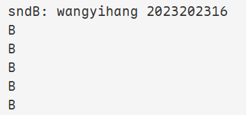
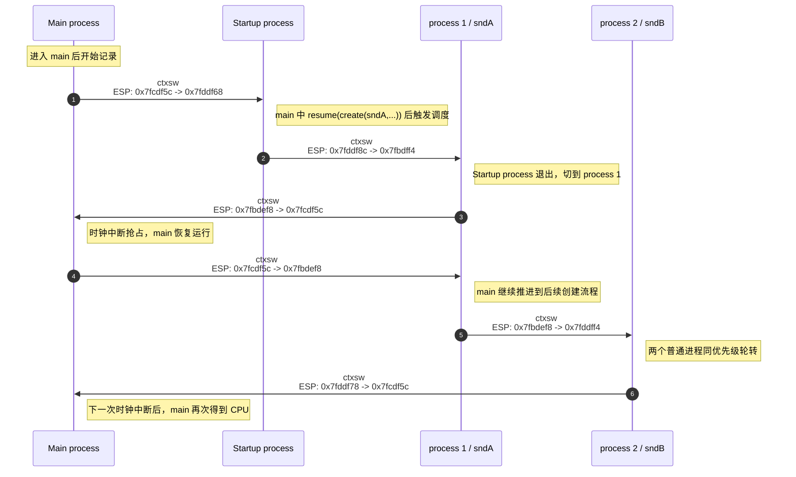
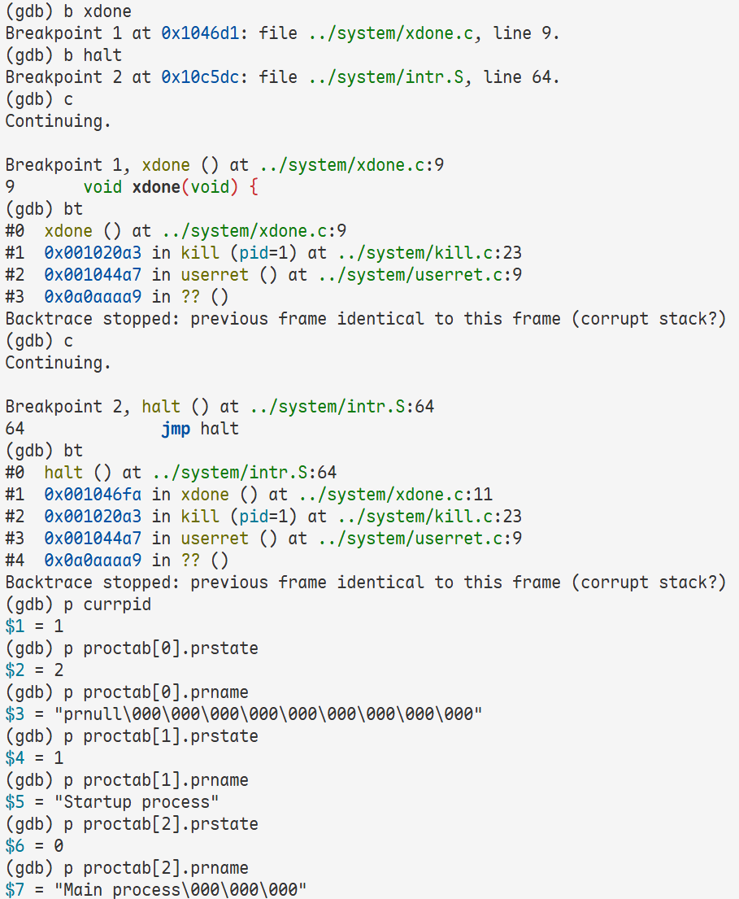

# 实验1 初识Xinu 实验报告

<div align="center">
    王艺杭<br>
    2023202316
</div>

## 实验内容与分析

### 并发输出示例的实现与现象分析

#### 代码修改思路

根据实验要求，在 `system/main.c` 中实现了两个持续输出字符的进程 `sndA` 和 `sndB`，并在 `main` 中创建并恢复这两个进程。其核心思路如下：

```c
void sndA(void) {
    while (TRUE) {
        fputs("A\n", CONSOLE);
    }
}

void sndB(void) {
    while (TRUE) {
        fputs("B\n", CONSOLE);
    }
}

void main(void) {
    resume(create((void *)sndA, 1024, 20, "process 1", 0));
    resume(create((void *)sndB, 1024, 20, "process 2", 0));
}
```

#### 情形 a：`main`、`sndA`、`sndB` 优先级一致

现象：A, B交替输出


其原因如下：

1. `resched()` 在判断当前进程是否继续执行时，使用的是严格大于号：

```c
if (ptold->prprio > firstkey(readylist)) {
    return;
}
```

这意味着只要就绪队列中存在“优先级大于或等于当前进程”的进程，就可能发生切换。因此“优先级相同”并不等于“当前进程一定继续执行”。

2. 就绪队列的插入函数 `insert()` 对相同优先级采用“排到已有同优先级进程之后”的策略：

```c
while (queuetab[curr].qkey >= key) {
    curr = queuetab[curr].qnext;
}
```

1. `main` 第一次执行 `resume(create(sndA,...))` 时，`create()` 先把 `sndA` 建好，`resume()` 再通过 `ready()` 把它插入 ready list。此时 ready list 中其实已经有一个先前留下的同优先级进程 `Startup process`。于是，在 `resched()` 把当前的 `main` 也按相同优先级插回队列后，队列顺序变成：

```text
Startup process -> sndA -> main
```

2. `Startup process` 很快执行结束并退出。它在退出时再次触发 `resched()`，这时 ready list 中剩下的主要就是：

```text
sndA -> main
```

3. `sndA` 运行一个时间片后，被时钟中断抢占。由于此时 ready list 中只有更早就在等待的 `main`，所以 `resched()` 会先把当前的 `sndA` 插回队尾，队列变为：

```text
main -> sndA
```

4. `main` 恢复运行后，会继续往下执行第二句 `resume(create(sndB,...))`。在这条语句执行期间，ready list 中已经有 `sndA`；当 `sndB` 被插入后，队列变为：

```text
sndA -> sndB
```

随后 `resched()` 再把当前的 `main` 插回队尾，得到：

```text
sndA -> sndB -> main
```

5. 当 `sndA` 第二次运行完一个时间片后，ready list 中已经同时有 `sndB` 和 `main`。此时 `resched()` 把 `sndA` 插回队尾，队列变成：

```text
sndB -> main -> sndA
```

因此接下来轮到 `sndB` 获得 CPU

#### 情形 b：`main` 优先级较低，`sndA` 与 `sndB` 优先级较高且相等

现象：只输出A



其原因是：

1. `main` 负责先后执行两句关键语句：

```c
resume(create(sndA, ...));
resume(create(sndB, ...));
```

2. 当 `main` 的优先级低于 `sndA` 时，第一句执行完成后，`sndA` 一旦进入就绪队列，就会立刻在 `resched()` 中压过 `main`，导致 CPU 转去执行 `sndA`。

3. 此后，`main` 不会再重新得到 CPU，因此它来不及执行第二句 `resume(create(sndB, ...))`。结果就是 `sndB` 根本没有被真正创建并投入运行，日志中自然不会出现 `B`。

4. 即使早期还可能短暂涉及 `Startup process`，可见输出的主体依然会被高优先级的 `sndA` 完全主导，因此最终日志表现为“只有 A”。

#### 情形 c：在 `sndA`、`sndB` 中进入 `while` 之前输出学号、姓名和函数名

从运行结果可以看出，两个进程都在正式进入死循环之前完成了身份信息打印。日志中对应的关键信息分别为：

```text
sndA: wangyihang 2023202316
sndB: wangyihang 2023202316
```





### 通过调试分析上下文切换流程



#### 进程切换顺序

| 次序 | 切换前进程 | 切换后进程 | `ESP` 变化 | 触发原因 |
| --- | --- | --- | --- | --- |
| 1 | `Main process` | `Startup process` | `0x7fcdf5c -> 0x7fddf68` | `main` 中 `resume(create(sndA,...))` 触发调度，而 `Startup process` 尚未退出 |
| 2 | `Startup process` | `process 1` | `0x7fddf8c -> 0x7fbdff4` | `Startup process` 返回并退出，调度到 `process 1` |
| 3 | `process 1` | `Main process` | `0x7fbdef8 -> 0x7fcdf5c` | 时钟中断触发抢占，`main` 恢复运行 |
| 4 | `Main process` | `process 1` | `0x7fcdf5c -> 0x7fbdef8` | `main` 继续推进到后续创建流程后再次让出 CPU |
| 5 | `process 1` | `process 2` | `0x7fbdef8 -> 0x7fddff4` | 两个普通进程同优先级，时间片到后切换到 `process 2` |
| 6 | `process 2` | `Main process` | `0x7fddf78 -> 0x7fcdf5c` | 下一次时钟中断后，`main` 再次得到 CPU |

#### 栈指针变化的含义

从上表可以看到，不同进程对应着不同的栈区间：

- `Main process` 的典型 `ESP` 为 `0x7fcdf5c`
- `Startup process` 的典型 `ESP` 为 `0x7fddf68` 或 `0x7fddf8c`
- `process 1` 的典型 `ESP` 为 `0x7fbdff4` 或 `0x7fbdef8`
- `process 2` 的典型 `ESP` 为 `0x7fddff4` 或 `0x7fddf78`

这说明每个进程都拥有各自独立的运行栈，而 `ctxsw(&old_sp, &new_sp)` 的本质，就是：

1. 先把旧进程现场压栈；
2. 把旧进程当前 `ESP` 保存到其 `prstkptr`；
3. 从新进程的 `prstkptr` 中取出新的 `ESP`；
4. 用这个新的 `ESP` 恢复寄存器和返回地址。

因此，`ESP` 的跳变本身就是“CPU 正在切换到另一条进程栈”的直接证据。

#### 刚改变 `ESP` 后与执行到 `ret` 处的调用栈区别

1. 执行 `movl (%eax), %esp` 之前：仍在旧进程栈上；
2. 执行 `movl (%eax), %esp` 之后但尚未 `ret`：已经切到新进程栈，但控制流还停在 `ctxsw` 内；
3. 执行 `ret` 之后：控制流真正转移到新进程的入口位置或被中断位置。

也就是说，最关键的区别是：

- `movl (%eax), %esp` 完成的是“栈切换”；
- `ret` 完成的是“控制流切换”。

因此，在“刚改变 `ESP`”与“执行到 `ret`”之间，会出现一个很短但很重要的过渡状态：CPU 已经在用新进程的栈，但 `EIP` 还没有离开 `ctxsw`。这时如果立刻执行 `bt`，GDB 看到的就会是“新栈内容 + 旧控制流位置”的混合结果，调用栈往往不稳定，甚至会出现异常回溯：

1. “恢复到一个已经运行过的旧进程”时，回溯基本还能识别出原来的调用链。

```text
#0  ctxsw () at ../system/ctxsw.S:36
#1  0x001038db in resched () at ../system/resched.c:44
#2  0x001035f3 in ready (pid=3) at ../system/ready.c:24
#3  0x00103a13 in resume (pid=3) at ../system/resume.c:26
#4  0x0010244e in main () at ../system/main.c:19
```

这说明此时虽然 `#0` 还停在 `ctxsw`，但栈上已经可以看出即将恢复到 `main` 的那条旧调用链。

1. “切换到一个刚创建的新进程”时，回溯往往显得不完整，甚至出现 `STACKMAGIC` 或 `corrupt stack?`。

```text
#0  ctxsw () at ../system/ctxsw.S:36
#1  0x001023cd in sndA () at ../system/main.c:8
#2  0x00000000 in ?? ()
Backtrace stopped: Cannot access memory at address 0xa0aaaad
```

以及：

```text
#0  ctxsw () at ../system/ctxsw.S:36
#1  0x001038db in resched () at ../system/resched.c:44
#2  0x001035f3 in ready (pid=2) at ../system/ready.c:24
#3  0x00103a13 in resume (pid=2) at ../system/resume.c:26
#4  0x00101b71 in startup () at ../system/initialize.c:103
#5  0x00104570 in unsleep (pid=0) at ../system/unsleep.c:45
#6  0x0a0aaaa9 in ?? ()
Backtrace stopped: previous frame identical to this frame (corrupt stack?)
```

这里的 `0x0a0aaaa9` 并不是随机值，而是 `process.h` 中定义的 `STACKMAGIC`。出现这种现象的原因是：新进程的栈并不是由正常函数调用一层层形成的，而是由 `create()` 手工伪造出来的。对一个刚创建、尚未真正运行过的进程来说，栈顶附近虽然包含入口地址 `funcaddr` 和退出地址 `INITRET`，但再往上并不是标准的 C 函数调用帧，所以 GDB 的栈回溯器很容易“顺着伪造栈继续往上走”，最终碰到 `STACKMAGIC`，于是报告调用栈损坏或无法继续解析。

因此：

- 刚改变 `ESP` 后：新栈已生效，但 `ctxsw` 还没返回，`bt` 处于半切换状态，结果可能混合甚至异常；
- 执行到 `ret` 处：比刚切换 `ESP` 时更接近新进程的真实现场，但 `#0` 仍是 `ctxsw`，仍可能看到不完整回溯；
- 真正 `ret` 到新进程、并在下一个断点停下后：控制流和栈都已经稳定，`bt` 才最能准确反映新进程当前所处的位置。

### 新建进程初始栈的观察与分析

#### 关键地址对比

```text
(gdb) p userret
$1 = {void (void)} 0x104570 <userret>

(gdb) p sndA
$2 = {void (void)} 0x102391 <sndA>
```

随后在 `create()` 中，对新栈执行了内存查看：

```text
(gdb) x/16xw saddr
0x7fbdfcc:      0x00000000      0x00000000      0x07fbdff0      0x07fbdfcc
0x7fbdfdc:      0x00000000      0x00000000      0x00000000      0x00000000
0x7fbdfec:      0x00000200      0x07fbdffc      0x00102391      0x00104570
0x7fbdffc:      0x0a0aaaa9      0x00000000      0x00000000      0x00000000
```

据此可以得到如下对应关系：

| 项目 | 数值 | 说明 |
| --- | --- | --- |
| `funcaddr` | `0x00102391` | 与 `p sndA` 输出完全一致 |
| `INITRET` 实际压栈值 | `0x00104570` | 与 `p userret` 输出完全一致 |
| 栈底标记 `STACKMAGIC` | `0x0A0AAAA9` | 用于检测栈溢出 |

#### 初始栈布局分析

结合 `create.c` 中的压栈顺序，`process 1` 的初始栈可以整理为：

| 地址 | 值 | 含义 |
| --- | --- | --- |
| `0x7fbdfcc` | `0x00000000` | `%edi` |
| `0x7fbdfd0` | `0x00000000` | `%esi` |
| `0x7fbdfd4` | `0x07fbdff0` | `%ebp`（供 `ctxsw` 完成恢复） |
| `0x7fbdfd8` | `0x07fbdfcc` | `%esp` 槽位，最终写回 `prstkptr` |
| `0x7fbdfdc` | `0x00000000` | `%ebx` |
| `0x7fbdfe0` | `0x00000000` | `%edx` |
| `0x7fbdfe4` | `0x00000000` | `%ecx` |
| `0x7fbdfe8` | `0x00000000` | `%eax` |
| `0x7fbdfec` | `0x00000200` | `EFLAGS`，中断允许位打开 |
| `0x7fbdff0` | `0x07fbdffc` | 供“进程退出路径”使用的 `ebp` |
| `0x7fbdff4` | `0x00102391` | 进程入口 `sndA` |
| `0x7fbdff8` | `0x00104570` | `INITRET`，即 `userret` |
| `0x7fbdffc` | `0x0A0AAAA9` | `STACKMAGIC` |

这个布局说明：

1. 新进程第一次被调度时，`ctxsw` 会把寄存器从这片“伪造好的保存现场”中恢复出来；
2. `ret` 之后不会回到某个“调用 `create` 的地方”，而是直接跳到 `funcaddr`，也就是 `sndA`；
3. 如果 `sndA` 从顶层函数返回，不会返回到用户自己写的其他函数，而是会跳到 `INITRET`，也就是 `userret`；
4. `userret()` 的实现是 `kill(getpid())`，因此顶层进程函数一旦返回，就会被系统回收。

这正是“Xinu 通过手工构造初始栈，把一个从未真正执行过的进程，伪装成一个即将从 `ctxsw` 返回的进程”的关键思想。

### 最后一个普通进程结束后的系统状态



#### 调试结果

先在 `xdone` 处命中断点：

```text
Breakpoint 1, xdone () at ../system/xdone.c:9
```

回溯结果为：

```text
#0  xdone () at ../system/xdone.c:9
#1  0x001020a3 in kill (pid=1) at ../system/kill.c:23
#2  0x001044a7 in userret () at ../system/userret.c:9
#3  0x0a0aaaa9 in ?? ()
```

继续执行后，在 `halt` 处再次断下：

```text
Breakpoint 2, halt () at ../system/intr.S:64
64              jmp halt
```

此时的回溯为：

```text
#0  halt () at ../system/intr.S:64
#1  0x001046fa in xdone () at ../system/xdone.c:11
#2  0x001020a3 in kill (pid=1) at ../system/kill.c:23
#3  0x001044a7 in userret () at ../system/userret.c:9
```

进一步检查当前进程和进程表项，得到：

| 检查项 | 值 | 含义 |
| --- | --- | --- |
| `currpid` | `1` | 当前仍是 `Startup process` |
| `proctab[0].prname` | `prnull` | 空进程 |
| `proctab[0].prstate` | `2` | `PR_READY` |
| `proctab[1].prname` | `Startup process` | 启动进程 |
| `proctab[1].prstate` | `1` | `PR_CURR` |
| `proctab[2].prname` | `Main process` | 主进程 |
| `proctab[2].prstate` | `0` | `PR_FREE` |

根据 `process.h` 中的状态定义：

- `PR_FREE = 0`
- `PR_CURR = 1`
- `PR_READY = 2`

所以此时系统状态可以表述为：

- `Main process` 已经结束并被回收；
- `Startup process` 作为最后一个普通进程，正处于当前运行态；
- `prnull` 并没有消失，而是仍然处于就绪态；
- CPU 已经进入 `halt:` 标签下的无限自旋：

```asm
halt:
    jmp halt
```

#### 为什么此时不是空进程在运行

这一现象最有价值的地方在于：虽然普通进程结束了，但系统并没有回到空进程循环中，而是停在 `halt()` 里。

原因在于 `kill()` 的实现：

```c
if (--prcount <= 1) { /* Last user process completes */
    xdone();
}
```

也就是说，当最后一个普通进程即将结束时，Xinu 不是“先把它彻底回收、再调度空进程”，而是直接在这个进程的上下文中调用 `xdone()`。而 `xdone()` 又会立刻调用：

```c
halt();
```

于是系统直接陷入：

```asm
jmp halt
```

因此：

- 最后一个普通进程的 `prstate` 仍保持为 `PR_CURR`；
- `currpid` 也仍然指向它；
- 空进程虽然还在 ready list 中，但已经没有机会再被调度到；
- 系统从“调度器可继续运行”的状态，转成了“处理器被强制停在内核死循环中”的状态。

它说明 Xinu 选择的是“由最后一个普通进程亲自执行收尾代码并直接停机”，而不是“退回空进程继续空转”。

## 实验结论与收获

1. Xinu 的“同优先级调度”并不是让当前进程一直执行，而是在时间片到达时仍会发生切换；是否切换取决于 `resched()` 中的严格大于号判断以及 ready list 的插入顺序。
2. 优先级差异会直接改变程序的“控制流可达性”。在 `main` 降低优先级后，第二个 `resume(create(...))` 甚至可能来不及执行，这是非常典型的并发程序现象。
3. `ctxsw` 的本质不是“魔法跳转”，而是“保存旧栈指针、切换到新栈指针、再按新栈恢复现场”。因此观察 `ESP` 的变化，是理解上下文切换最直接的方法。
4. Xinu 为新进程构造的初始栈非常精巧：第一次运行时从 `ctxsw` 的视角看，它就像一个“早已被切换出去、现在又切换回来”的进程；其执行路径自然形成 `funcaddr -> userret -> kill`。
5. 最后一个普通进程结束后，系统并不会自动回到空进程继续空转，而是由当前进程直接进入 `xdone()` 和 `halt()`，从而停在内核的死循环中。
