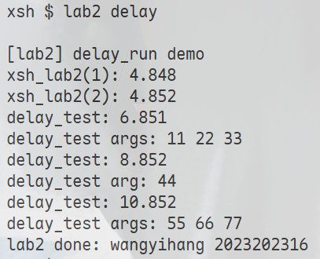
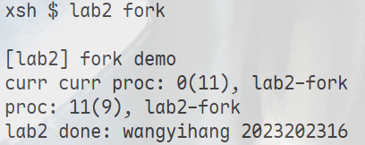
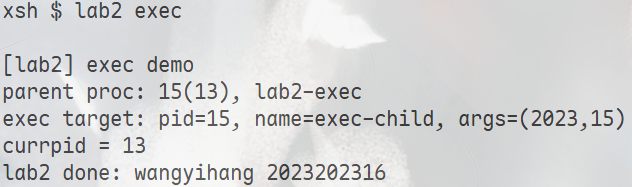

# 实验2报告（第一阶段 + 第二阶段）

<div style="text-align:center">
    王艺杭<br>
    2023202316
</div>

---

## 实验目的

本实验包含两个部分。

第一阶段的目标是探索异步事件的实现方式，在 Xinu 中实现一个非阻塞的延时调用接口，使当前进程可以在发起延时任务后立即继续执行，而不必像 `sleep()` 一样进入阻塞状态。

第二阶段的目标是将创建进程的方式从传统的 `create()` 风格，进一步改造成更接近现代操作系统课程中常见的 `fork/exec` 风格，从而加深对进程上下文、栈、调度和执行入口切换机制的理解。

---

## 实现文件与改动概览

主要代码集中实现于 `shell/xsh_lab2.c`，其余文件只做最少量的接口接入修改。

- `shell/xsh_lab2.c`
  - 实现 `xsh_lab2`
  - 实现第一阶段的 `k2023202316_delay_run`
  - 实现第二阶段的 `k2023202316_fork` 与 `k2023202316_exec`
  - 实现实验所需的测试函数与辅助内部函数
- `include/prototypes.h`
  - 增加 `k2023202316_delay_runv`
  - 增加 `k2023202316_fork`
  - 增加 `k2023202316_exec`
  - 增加 `k2023202316_delay_run(...)` 可变参数计数宏
- `include/shprototypes.h`
  - 增加 `xsh_lab2` 的声明
- `shell/shell.c`
  - 在 `cmdtab` 中注册 `lab2` 命令

### Shell 命令接入

做了如下接入：

1. 在 `include/shprototypes.h` 中声明 `xsh_lab2`
2. 在 `shell/shell.c` 的 `cmdtab` 中加入 `{"lab2", FALSE, xsh_lab2}`

`xsh_lab2` 支持以下运行方式：

- `lab2`
- `lab2 all`
- `lab2 delay`
- `lab2 fork`
- `lab2 exec`
- `lab2 --help`

其中默认 `lab2` 与 `lab2 all` 会顺序执行三个演示：`delay -> fork -> exec`。

### 公共接口设计

暴露的接口如下：

| 接口 | 作用 |
| --- | --- |
| `k2023202316_delay_run(seconds, func, ...)` | 异步延时调用入口 |
| `k2023202316_delay_runv(seconds, func, nargs, ...)` | `delay_run` 的底层可变参数实现 |
| `k2023202316_fork(void)` | 复制当前执行现场，父进程返回子 PID，子进程返回 `0` |
| `k2023202316_exec(func, prio, name, nargs, ...)` | 在当前 PID 内替换执行上下文并跳转到新入口 |

其中 `k2023202316_delay_run` 采用宏方式统计参数个数，然后转发到真正的实现函数 `k2023202316_delay_runv`。这样既保留了实验要求中的调用外观，又避免了运行时去猜测参数个数。

---

## 异步延时 `k2023202316_delay_run`

### 设计思路

- `k2023202316_delay_run` 负责解析参数并创建一个短生命周期的 worker 进程
- worker 进程先执行 `sleep(seconds)`
- 睡眠结束后，worker 通过统一分发器调用目标函数
- worker 运行结束后自然退出

### 参数分发机制

由于 `func` 的参数个数不固定，`delay_run` 和 `exec` 都复用了同一个内部函数 `k2023202316_invoke(func, nargs, a1, ..., a5)`。

其核心思想是：

- 当 `nargs == 0` 时，把 `func` 解释成 `void (*)(void)`
- 当 `nargs == 1` 时，把 `func` 解释成 `void (*)(int32)`
- 当 `nargs == 2` 时，把 `func` 解释成 `void (*)(int32, int32)`
- 依次类推，直到 5 个参数

### 测试方法

测试命令：

```bash
lab2 delay
```



| 调用 | 预期延时 | 实际触发时间 | 结论 |
| --- | --- | --- | --- |
| 第 1 次 | 2 秒 | 从 `4.852` 到 `6.851`，约 2 秒 | 符合预期 |
| 第 2 次 | 4 秒 | 从 `4.852` 到 `8.852`，约 4 秒 | 符合预期 |
| 第 3 次 | 6 秒 | 从 `4.852` 到 `10.852`，约 6 秒 | 符合预期 |

其中 `xsh_lab2(1)` 与 `xsh_lab2(2)` 的时间几乎相邻，仅有极小的调度与打印开销，说明 `k2023202316_delay_run` 没有阻塞当前进程，满足实验要求中的“异步”特性。

第一组输出中 `6.851` 与理论上的 `6.852` 相差 1ms，这属于时钟粒度和调度时机带来的正常抖动，不影响功能正确性。

---

## `k2023202316_fork` 的实现

### 实现思路

`k2023202316_fork()` 的核心思路是：

1. 在父进程栈上准备一份临时状态 `struct k2023202316_fork_state`
2. 创建一个短生命周期的高优先级 helper 进程
3. helper 在父进程至少发生过一次上下文保存之后运行
4. helper 使用 `create()` 创建一个占位子进程
5. 将父进程当前“已保存”的活动栈段复制到子进程栈中
6. 修正保存的 `ebp` 链，使子进程可沿相同调用路径继续恢复
7. 修改复制后的 `fork_state.role = 0`
8. helper 将子 PID 写回父进程状态并唤醒父进程
9. 父进程从 `k2023202316_fork()` 返回子 PID，子进程之后从相同执行点返回 `0`

也就是说，本实现并不是“创建一个全新的函数入口进程”，而是尽量让子进程从与父进程相同的 `fork` 返回点继续运行。

### 为什么采用 helper 进程

如果直接在当前调用 `fork` 的进程内部一边运行、一边复制自己的活动栈，会遇到一个很不稳定的问题：此时栈仍在持续变化，复制时很难得到一个稳定的保存现场。

因此本实现采用 helper 进程方案：

- 父进程先创建 helper
- helper 运行时，父进程已经完成一次上下文切换
- 此时 `parent->prstkptr` 指向的是可被 `ctxsw` 恢复的保存现场

这样复制得到的是一个更接近“静止快照”的栈段，而不是一个仍在快速变化的活动栈。

### 测试方法

测试命令：

```bash
lab2 fork
```



据此可以分析出：

- 父进程路径中：
  - 返回值为 `11`
  - 当前 PID 为 `9`
  - 表明子进程 PID 为 `11`
- 子进程路径中：
  - 返回值为 `0`
  - 当前 PID 为 `11`

---

## `k2023202316_exec` 的实现

### 实现思路

`k2023202316_exec()` 的目标不是创建新进程，而是在“当前 PID”内切换到新的执行入口。因此本实现采用如下过程：

1. 为当前进程分配一块新的栈空间，大小沿用旧栈大小
2. 按照 Xinu `create()` 的建栈方式，为一个 bootstrap 函数构造初始栈帧
3. 将旧栈基址、旧栈长度、目标函数地址、参数个数和参数值一并压入新栈
4. 更新当前 `procent` 中的优先级、进程名、栈基址和栈顶指针
5. 使用内联汇编把 `esp` 切换到新的 `prstkptr`
6. 按与 `ctxsw` 尾部兼容的恢复序列恢复寄存器并 `ret`
7. 在新栈上的 `k2023202316_exec_bootstrap()` 中先释放旧栈，再调用目标函数
8. 目标函数自然返回到 `userret`，进程退出

### 测试方法

测试命令：

```bash
lab2 exec
```



结果分析：

- `parent proc: 15(13), lab2-exec`
  - 父进程 PID 为 `13`
  - `fork` 返回子进程 PID `15`
- `exec target: pid=15, name=exec-child, args=(2023,15)`
  - 子进程没有创建新 PID，而是在 PID `15` 内切换到了新的执行入口
  - 新进程名已经变为 `exec-child`
  - 参数传递正确
- `currpid = 13`
  - 这行只在父进程中出现一次
  - 说明子进程没有从 `k2023202316_exec()` 正常返回到原调用点
