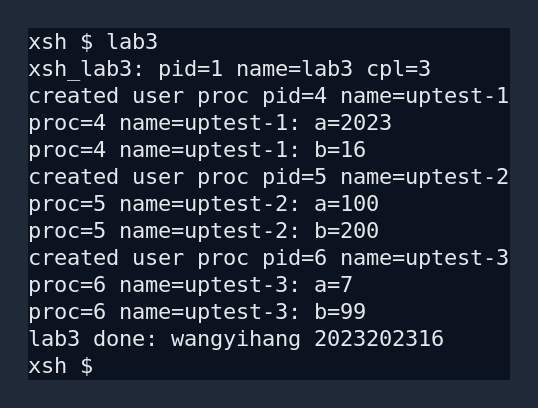
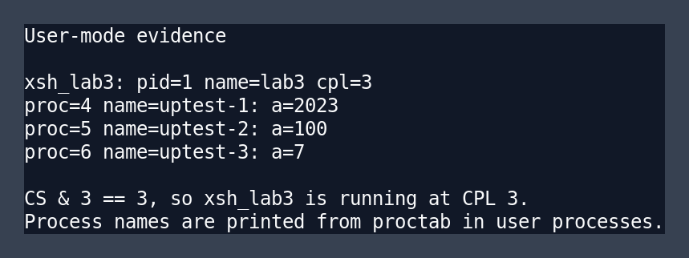

# 实验 3：特权级与系统调用

<div style="text-align:center">
    王艺杭<br>
    2023202316
</div>

---

## 实验目的

本实验的目标是在 Xinu 中补充用户态执行环境，使指定 shell 命令 `xsh_lab3` 能够从内核态创建后进入用户态运行，并通过系统调用完成输出、睡眠、创建用户态进程、恢复进程、等待子进程退出和正常退出等操作。

实验重点包括：

- 理解 x86 保护模式下 CPL、段选择子、GDT、IDT 和 TSS 在特权级切换中的作用。
- 使用 `iret` 从内核态切换到用户态。
- 使用 `int 0x80` 从用户态进入内核态执行系统调用。
- 为用户态进程维护独立的用户栈和内核栈。
- 保证用户态 shell 命令与其创建的 `uptest` 进程都能通过 `return` 正常结束。

---

## 新增文件与修改文件概览

### 新增文件

| 文件 | 作用 |
| --- | --- |
| `include/Lab3.h` | 集中声明实验 3 新增的常量、系统调用号、内核态函数和用户态函数。 |
| `include/tss.h` | 保存实验提供的 TSS 结构定义，供 TSS 初始化和加载使用。 |
| `system/Lab3_init.c` | 初始化 TSS，设置 TSS 描述符，设置可由用户态调用的 `int 0x80` IDT 门。 |
| `system/Lab3_asm.S` | 实现 `ltr`、从内核态 `iret` 到用户态、系统调用汇编入口。 |
| `system/Lab3_syscall.c` | 实现系统调用分发函数 `k2023202316_syscall_dispatch`。 |
| `system/Lab3_userlib.c` | 实现用户态系统调用封装，如 `u2023202316_printf`、`u2023202316_sleepms` 等。 |
| `system/Lab3_create_user_proc.c` | 实现通用的用户态进程创建函数 `k2023202316_create_user_proc`。 |
| `shell/xsh_lab3.c` | 实现实验要求的 shell 命令 `xsh_lab3` 和用户态测试函数 `u2023202316_uptest`。 |

### 修改过的原有文件

| 文件 | 修改内容 |
| --- | --- |
| `include/xinu.h` | 引入 `Lab3.h`，使新增接口对系统其他文件可见。 |
| `include/process.h` | 在进程表项中增加是否为用户态进程、用户栈指针、用户栈基址和用户栈大小字段。 |
| `include/shprototypes.h` | 增加 `xsh_lab3` 的函数声明。 |
| `shell/shell.c` | 在 `cmdtab` 中注册 `lab3` 命令，并让该命令通过用户态进程创建函数创建。 |
| `shell/addargs.c` | 对用户态命令单独把 shell 参数复制到用户栈中。 |
| `system/start.S` | 将 GDT 项数从 4 扩展到 7。 |
| `system/meminit.c` | 增加用户代码段、用户数据段和 TSS 描述符槽位。 |
| `system/initialize.c` | 初始化进程表新增字段，并在系统初始化阶段调用 `k2023202316_init()`。 |
| `system/create.c` | 创建普通内核态进程时初始化 Lab3 新增进程字段。 |
| `system/resched.c` | 每次调度到新进程前更新 TSS 中的 `esp0`。 |
| `system/kill.c` | 用户态进程退出时释放用户栈，并避免错误关闭从父进程继承的标准输入输出描述符。 |
| `system/clkdisp.S` | 时钟中断从用户态进入时切换到内核数据段，返回用户态前恢复用户数据段。 |
| `device/tty/ttydispatch.S` | tty 中断从用户态进入时切换到内核数据段，返回用户态前恢复用户数据段。 |

---

## 总体设计

本实现没有把原有 `create()` 改造成同时支持内核态和用户态，而是新增一个通用用户态进程创建函数：

```c
pid32 k2023202316_create_user_proc(void *funcaddr, uint32 ssize,
                                   pri16 priority, char *name,
                                   uint32 nargs, ...);
```

它的参数列表保持和原来的 `create()` 一致，便于 shell 和用户态库复用。不过按照实验要求，用户态进程固定使用：

- 优先级：`INITPRIO`，即 20
- 内核态栈：4KB
- 用户态栈：8KB

因此传入的 `ssize` 和 `priority` 参数只保留接口兼容性，实际创建时使用固定值。

总体控制流如下：

1. 内核启动后在 `sysinit()` 中调用 `k2023202316_init()`。
2. `k2023202316_init()` 初始化 TSS、加载 TR，并设置 `int 0x80` 系统调用门。
3. shell 注册 `lab3` 命令，但创建 `lab3` 命令进程时不使用普通 `create()`，而使用 `k2023202316_create_user_proc()`。
4. `lab3` 进程第一次被调度时，先在内核栈上恢复到 `k2023202316_iret_to_user()`。
5. `k2023202316_iret_to_user()` 构造用户态 `iret` 栈帧，把 CS 切到用户代码段，把 SS/DS/ES/FS/GS 切到用户数据段，最终进入 CPL 3 执行 `xsh_lab3`。
6. 用户态代码调用 `u2023202316_*` 函数，通过 `int 0x80` 进入内核完成实际服务。
7. `xsh_lab3` 创建 3 个用户态 `uptest` 进程，分别恢复并等待它们退出。
8. `xsh_lab3` 和 `uptest` 都通过 `return` 返回到用户栈上的 `u2023202316_exit()`，再由系统调用杀死当前进程，完成正常退出。

---

## GDT、TSS 与用户态入口

### 段选择子设计

在 `include/Lab3.h` 中定义了本实验使用的主要段选择子：

| 名称 | 数值 | 含义 |
| --- | --- | --- |
| `K2023202316_KCODE_SEL` | `0x08` | 内核代码段，DPL 0。 |
| `K2023202316_KDATA_SEL` | `0x10` | 内核数据段，DPL 0。 |
| `K2023202316_KSTACK_SEL` | `0x18` | 内核栈段，DPL 0。 |
| `K2023202316_UCODE_SEL` | `0x23` | 用户代码段，DPL 3，RPL 3。 |
| `K2023202316_UDATA_SEL` | `0x2B` | 用户数据段，DPL 3，RPL 3。 |
| `K2023202316_TSS_SEL` | `0x30` | TSS 描述符选择子。 |

原来的 GDT 只有空描述符、内核代码段、内核数据段和内核栈段。实验中在 `system/start.S` 和 `system/meminit.c` 中把 GDT 扩展为 7 项，新增：

- 第 4 项：用户代码段，访问字节为 `0xfa`
- 第 5 项：用户数据段，访问字节为 `0xf2`
- 第 6 项：TSS 描述符槽位，运行时由 `k2023202316_set_tss_desc()` 填充

用户代码段和用户数据段仍然采用平坦地址空间。这样做符合实验说明中“Xinu 无法有效区分内核态代码/数据和用户态代码/数据”的情况，重点在于完成特权级切换机制，而不是实现完整的地址空间隔离。

### TSS 的作用

本实验使用 TSS 的主要目的不是硬件任务切换，而是为从 CPL 3 进入 CPL 0 时提供内核栈。`include/tss.h` 中的 `struct taskstate` 保存了 `esp0` 和 `ss0` 等字段。

在 `system/Lab3_init.c` 中：

1. 清空全局变量 `k2023202316_tss`。
2. 设置 `k2023202316_tss.ss0 = K2023202316_KSTACK_SEL`。
3. 设置 `iomb = sizeof(struct taskstate)`，关闭额外 I/O 位图。
4. 在 GDT 第 6 项写入 TSS 描述符。
5. 调用汇编函数 `k2023202316_ltr()` 执行 `ltr`，加载任务寄存器。

由于不同进程有不同内核栈，`system/resched.c` 在每次切换到新进程前调用：

```c
k2023202316_set_tss_esp0(currpid);
```

它把 `TSS.esp0` 更新为当前被调度进程的内核栈顶。这样当用户态进程执行 `int 0x80` 或发生外部中断时，CPU 能自动切到该进程对应的内核栈，而不是所有进程共用同一个内核栈。

### 通过 `iret` 进入用户态

用户态进程的第一次运行仍然由普通调度器 `ctxsw()` 恢复。但是它的内核栈不是直接返回到目标函数，而是返回到 `k2023202316_iret_to_user()`。

该汇编函数完成以下工作：

1. 从内核栈参数中取出用户态入口地址和用户栈顶。
2. 把 DS/ES/FS/GS 设置为用户数据段选择子 `0x2B`。
3. 构造 `iret` 所需的 5 个值：用户 SS、用户 ESP、EFLAGS、用户 CS、用户 EIP。
4. 设置 EFLAGS.IF，保证用户态运行时可以响应中断。
5. 执行 `iret`。

因为 `iret` 栈帧中的 CS 为 `0x23`，低两位 RPL 为 3，所以 CPU 会进入 CPL 3，开始执行用户态函数。

---

## 系统调用实现

用户态不能直接调用内核函数，否则无法体现用户态到内核态的受控切换。因此本实验实现了基于 `int 0x80` 的系统调用机制。

### IDT 门设置

在 `k2023202316_set_syscall_gate()` 中设置 IDT 第 `0x80` 项：

- 入口地址：`k2023202316_syscall_entry`
- 段选择子：内核代码段 `0x08`
- 类型：32 位 interrupt gate
- DPL：3
- Present：1

DPL 设置为 3 是关键。只有这样，CPL 3 的用户态代码才能合法执行 `int $0x80`。进入系统调用入口后，CPU 根据 TSS 中的 `ss0:esp0` 自动切换到内核栈，并把返回用户态所需的现场压入内核栈。

### 汇编入口和 C 分发函数

用户态库的通用入口是：

```c
int32 u2023202316_syscall(uint32 sysno, uint32 a1, uint32 a2,
                          uint32 a3, uint32 a4, uint32 a5);
```

它使用内联汇编把系统调用号和参数放入寄存器，然后执行：

```asm
int $0x80
```

进入内核后，`system/Lab3_asm.S` 中的 `k2023202316_syscall_entry` 会：

1. `pushal` 保存通用寄存器。
2. 把 DS/ES/FS/GS 切换到内核数据段 `0x10`。
3. 按约定把寄存器中的系统调用号和参数压栈。
4. 调用 C 函数 `k2023202316_syscall_dispatch()`。
5. 把分发函数返回值写回保存现场中的 EAX。
6. 把 DS/ES/FS/GS 恢复为用户数据段 `0x2B`。
7. `popal` 并 `iret` 返回用户态。

本实验实现的系统调用如下：

| 系统调用号 | 用户态封装 | 内核态实际操作 |
| --- | --- | --- |
| `K2023202316_SYS_GETPID` | `u2023202316_getpid()` | 调用 `getpid()`。 |
| `K2023202316_SYS_PUTC` | `u2023202316_putc()` | 调用 `putc()`。 |
| `K2023202316_SYS_SLEEPMS` | `u2023202316_sleepms()` | 调用 `sleepms()`。 |
| `K2023202316_SYS_EXIT` | `u2023202316_exit()` | 调用 `kill(getpid())` 结束当前进程。 |
| `K2023202316_SYS_CREATE_USER_PROC` | `u2023202316_create_user_proc()` | 调用 `k2023202316_create_user_proc()`。 |
| `K2023202316_SYS_RESUME` | `u2023202316_resume()` | 调用 `resume()`。 |
| `K2023202316_SYS_RECEIVE` | `u2023202316_receive()` | 调用 `receive()`。 |

其中 `u2023202316_printf()` 使用 Xinu 原有 `_fdoprnt()` 做格式化，但输出字符时不直接调用内核 `putc()`，而是通过 `u2023202316_putc()` 进入系统调用。这保证了 `xsh_lab3` 和 `uptest` 在用户态运行时仍能正常打印。

---

## 用户态进程创建流程

`k2023202316_create_user_proc()` 是本实验中最核心的通用创建函数。它不是只为 `uptest` 写死，而是接收函数地址、进程名和可变参数，因此可以创建不同入口函数的用户态进程。

主要流程如下：

1. 检查入口函数地址和参数个数。当前最多支持 5 个用户参数。
2. 关闭中断，分配 PID。
3. 分配 4KB 内核栈和 8KB 用户栈。
4. 在用户栈上放入参数，并压入返回地址 `u2023202316_exit`。
5. 填写进程表项：
   - `prstate = PR_SUSP`
   - `prprio = INITPRIO`
   - `prstkbase` 和 `prstklen` 指向内核栈
   - `pr2023202316_isuser = TRUE`
   - `pr2023202316_ustkbase`、`pr2023202316_ustkptr`、`pr2023202316_ustklen` 保存用户栈信息
   - `prname` 保存用户态进程名称
6. 继承父进程的设备描述符，使用户态命令仍能使用 shell 的标准输入输出。
7. 在内核栈上构造一个与 `ctxsw()` 兼容的保存现场，使第一次恢复时跳到 `k2023202316_iret_to_user()`。
8. 恢复中断并返回新进程 PID。

用户栈布局中最重要的是返回地址。`xsh_lab3` 和 `u2023202316_uptest` 的函数体都以 `return` 结束，而不是通过无限循环或直接调用 `kill()` 逃避返回。函数返回后会落到用户栈上的 `u2023202316_exit()`，它再通过系统调用进入内核结束当前进程。因此满足实验要求中的“`xsh_lab3` 和 `uptest` 均以 `return` 正常结束”。

### shell 参数复制

普通内核态 shell 命令的参数保存在内核栈上，而 `lab3` 是用户态进程，所以 `shell/addargs.c` 中增加了用户态进程分支：

- 如果 `pr2023202316_isuser` 为真，则把 `argv` 数组和字符串区域复制到用户栈底部。
- 在用户栈中查找创建时占位的 dummy 参数，并把它替换成用户栈中的 `argv` 地址。

这样 `xsh_lab3(int nargs, char *args[])` 在用户态运行时仍能正确访问命令行参数，并支持 `lab3 --help`。

---

## 中断处理的补充修改

用户态进程运行时，时钟中断和 tty 中断可能随时发生。CPU 进入中断处理程序时会根据 IDT 和 TSS 切到内核栈，但段寄存器 DS/ES/FS/GS 的值仍可能是用户数据段。如果直接调用 C 语言中断处理函数，内核访问全局变量和设备结构时会使用不合适的段寄存器。

因此本实验修改了：

- `system/clkdisp.S`
- `device/tty/ttydispatch.S`

中断入口保存寄存器后，先把 DS/ES/FS/GS 设置为内核数据段 `0x10`，再调用 `clkhandler()` 或 `ttyhandler()`。返回前检查被中断代码的 CS 低两位，如果原来来自 CPL 3，则把 DS/ES/FS/GS 恢复为用户数据段 `0x2B`；如果原来来自内核态，则保持内核数据段。这样可以保证中断处理函数在内核态访问数据正确，同时用户态进程恢复后仍处于用户数据段环境。

---

## `xsh_lab3` 与 `uptest` 测试流程

`shell/xsh_lab3.c` 中实现了实验要求的测试命令。

### `xsh_lab3`

`xsh_lab3` 运行后首先输出当前 PID、进程名和 CPL：

```c
pid = u2023202316_getpid();
u2023202316_printf("xsh_lab3: pid=%d name=%s cpl=%d\n", pid,
                   proctab[pid].prname, u2023202316_getcpl());
```

其中 `u2023202316_getcpl()` 通过读取 CS 并取低两位得到 CPL：

```c
asm volatile("movw %%cs,%0" : "=r"(cs));
return cs & 0x3;
```

输出中 `cpl=3` 表示 `xsh_lab3` 的指令确实运行在用户态。

然后 `xsh_lab3` 用不同参数创建并启动 3 个用户态 `uptest` 进程：

| 进程名 | 参数 a | 参数 b |
| --- | --- | --- |
| `uptest-1` | `2023` | `16` |
| `uptest-2` | `100` | `200` |
| `uptest-3` | `7` | `99` |

每个 `uptest` 创建后由 `u2023202316_resume()` 启动，`xsh_lab3` 再通过 `u2023202316_receive()` 等待子进程退出消息。等待到对应 PID 后再创建下一组测试进程，因此输出顺序稳定，便于观察。

### `uptest`

`uptest` 的用户态函数为：

```c
local process u2023202316_uptest(int32 a, int32 b) {
  pid32 pid;

  pid = u2023202316_getpid();
  u2023202316_printf("proc=%d name=%s: a=%d\n", pid, proctab[pid].prname, a);
  u2023202316_sleepms(10);
  u2023202316_printf("proc=%d name=%s: b=%d\n", pid, proctab[pid].prname, b);
  return OK;
}
```

它满足实验流程：

1. 输出进程 ID、进程名和第一个参数。
2. 调用 `u2023202316_sleepms(10)` 睡眠 10ms。当前 Xinu 的 `QUANTUM` 为 2ms，因此睡眠时间不少于一个时间片。
3. 输出进程 ID、进程名和第二个参数。
4. 通过 `return OK` 正常结束。

为了满足“调试状态下查看正确进程名称，或者直接在用户进程中输出进程名称”的要求，本实验选择直接在用户态进程中输出 `proctab[pid].prname`。运行结果中可以看到 `lab3`、`uptest-1`、`uptest-2` 和 `uptest-3` 的名称都正确。

实验要求返回前输出学号和姓名。如果中文输出出现乱码，可使用拼音。本实现最后输出：

```text
lab3 done: wangyihang 2023202316
```

---

## 测试结果与现象分析

### 非调试状态下运行 `lab3`

在非调试状态下，shell 中执行 `lab3`，命令能够创建 3 个用户态 `uptest` 进程并正常回到 shell 提示符。



从该输出可以验证：

- `xsh_lab3` 输出 `cpl=3`，说明它运行在用户态。
- `xsh_lab3` 的进程名为 `lab3`，说明 shell 创建用户态命令进程时保存了正确名称。
- 三个子进程名称分别为 `uptest-1`、`uptest-2`、`uptest-3`。
- 三组参数分别为 `(2023,16)`、`(100,200)`、`(7,99)`，满足“至少以不同参数创建并启动 3 次”的要求。
- 每个 `uptest` 都先输出第一个参数，睡眠后再输出第二个参数。
- 最后一行输出姓名拼音和学号后，系统回到 `xsh $` 提示符，说明非调试状态下命令正常结束。

### 用户态与进程名证据



`cpl=3` 的判断来自当前 CS 选择子的低两位。用户代码段选择子为 `0x23`，其低两位为 `3`，因此 `u2023202316_getcpl()` 返回 3。

用户态进程名称直接从 `proctab[pid].prname` 中读取并输出。实验说明允许用户态访问 Xinu 的进程表项用于输出进程名称，因此这里没有额外封装成系统调用。输出中可以看到：

- `name=lab3`
- `name=uptest-1`
- `name=uptest-2`
- `name=uptest-3`

这说明父进程和 3 个用户态子进程的进程名都正确。

### 构建与辅助命令验证

在 `compile/` 目录执行 `make` 可以编译通过。实验过程中还验证了：

- `lab3 --help` 能正确输出帮助信息。
- `help lab3` 能列出 `lab3` 命令。
- `echo ok`、`ps` 等原有命令仍可运行。

---

## 关键问题分析

### 为什么用户态进程需要两套栈

用户态进程运行普通函数时使用用户栈；发生系统调用、中断或异常并进入 CPL 0 后，CPU 会根据 TSS 切换到内核栈。如果只使用一套栈，会导致用户态可以直接影响内核执行现场，也不符合 x86 特权级切换的工作方式。

因此本实现为每个用户态进程分配：

- 4KB 内核栈：保存系统调用、中断和调度相关内核现场。
- 8KB 用户栈：保存用户态函数参数、返回地址和普通调用栈。

进程表中的 `prstkbase/prstklen/prstkptr` 仍表示内核栈，新增的 `pr2023202316_ustkbase/pr2023202316_ustkptr/pr2023202316_ustklen` 表示用户栈。

### 为什么退出要通过 `u2023202316_exit`

普通 Xinu 进程的返回地址是 `userret`，它运行在内核态。用户态进程不能直接返回到内核态函数，否则会破坏特权级约束。

因此创建用户态进程时，在用户栈上压入的返回地址是 `u2023202316_exit`。用户函数 `return` 后仍在用户态执行 `u2023202316_exit()`，再通过 `int 0x80` 请求内核执行 `kill(getpid())`。这样既保留了“以 return 正常结束”的语义，也保证了用户态到内核态的入口是受控的系统调用。

### 为什么 `kill()` 要单独处理用户栈

普通进程只有一块运行栈，`kill()` 释放 `prstkbase/prstklen` 即可。用户态进程有内核栈和用户栈两块内存，因此退出时必须同时释放用户栈，否则会造成内存泄漏。

本实验在 `system/kill.c` 中检查 `pr2023202316_isuser`。如果当前被杀死的是用户态进程，并且用户栈存在，就先释放 `pr2023202316_ustkbase/pr2023202316_ustklen`，再释放内核栈，并清空用户态相关字段。

同时，用户态命令继承了 shell 的标准输入输出描述符。若用户态子进程退出时像普通进程一样关闭前 3 个描述符，可能影响父进程 shell 继续输出。因此对用户态进程跳过关闭继承的标准输入输出描述符。

---

## 实验结论

本实验在 Xinu 中实现了一个最小但完整的用户态运行框架：

- 新增用户代码段、用户数据段和 TSS 描述符。
- 初始化 TSS，并在调度时更新 `esp0`。
- 通过 `iret` 将新创建的进程切换到 CPL 3。
- 通过 `int 0x80` 实现用户态到内核态的系统调用。
- 实现通用用户态进程创建函数，而不是只针对 `uptest` 特判。
- 使 `xsh_lab3` 在用户态运行，并创建 3 个不同参数的用户态 `uptest` 进程。
- `xsh_lab3` 和 `uptest` 均通过 `return` 正常结束。
- 非调试状态下执行 `lab3` 后能正常回到 shell。

从运行输出可以看到 `xsh_lab3` 的 CPL 为 3，用户态进程名称正确，参数传递正确，睡眠和退出流程正确。
