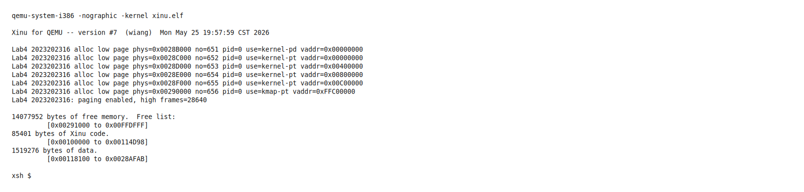
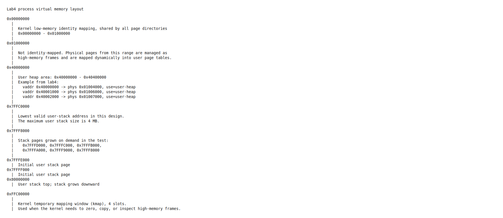
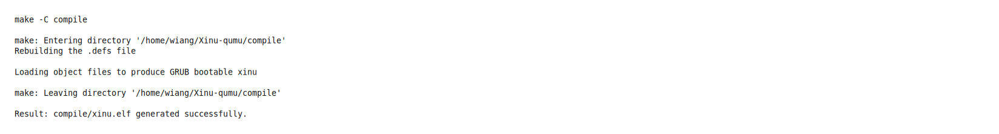
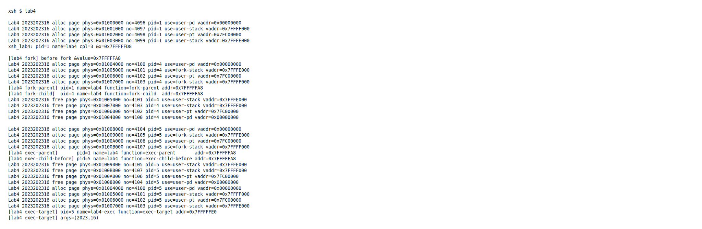
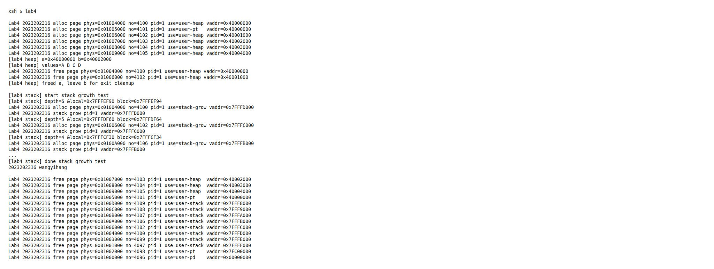
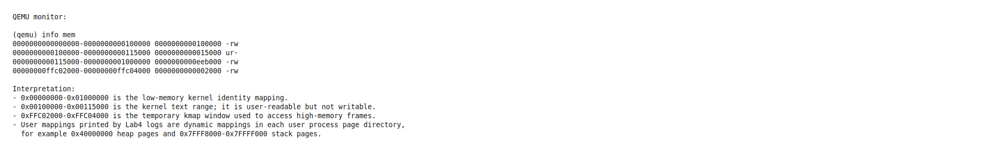
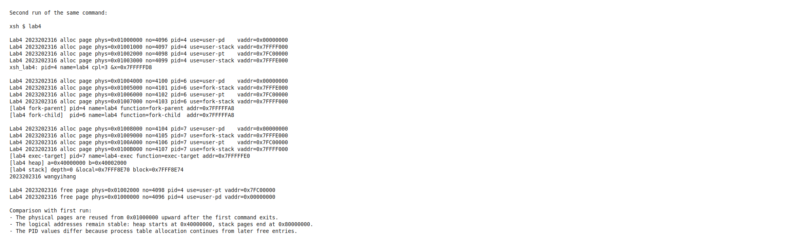
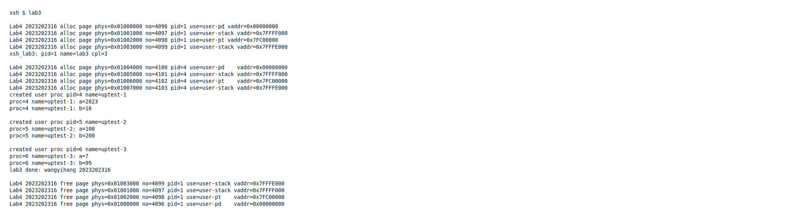

# 实验 4：页式内存管理

<div style="text-align:center">
    王艺杭<br>
    2023202316
</div>

---

## 实验目的

本实验在前一次实验完成的用户态和系统调用机制基础上，为 Xinu 增加 32 位 x86 页式内存管理。实现目标包括：

- 开启分页并维护内核页目录。
- 为用户态进程建立独立地址空间，实现内核态/用户态隔离。
- 在分页环境下支持用户态 `fork()` 和 `exec()`。
- 实现用户态 `lab4` 命令，并在其中测试 fork、exec、堆页分配、用户栈增长和退出释放。
- 保证实验 3 的用户态 `lab3` 命令仍能在分页环境下正常运行。

---

## 新增文件与修改文件概览

### 新增文件

| 文件 | 作用 |
| --- | --- |
| `include/Lab4.h` | 定义页大小、页表项标志、用户堆/栈布局、Lab4 系统调用号、trapframe 结构，以及 Lab4 内核/用户态接口声明。 |
| `system/Lab4_vm.c` | 实现页式内存管理主体：页框管理、页目录/页表创建、地址空间切换、fork/exec 地址空间处理、用户堆、用户栈扩展、用户空间释放。 |
| `system/Lab4_asm.S` | 实现 `cr3/cr0/cr2` 读写、`invlpg`、从 trapframe 返回用户态、页故障汇编入口。 |
| `shell/xsh_lab4.c` | 实现实验 4 shell 命令，包含用户态运行验证、fork 测试、exec 测试、堆测试、栈增长测试和学号姓名输出。 |
| `docs/exp4.md`、`docs/exp4.pdf` | 实验要求文档。 |
| `report/exp4.md` | 本实验报告源文件。 |
| `report/exp4_assets/*` | 报告中使用的命令输出素材和渲染脚本。 |
| `report/imgs/exp4_*.png` | 由真实构建/QEMU 输出转成的报告图片。 |

### 修改过的原有文件

| 文件 | 修改内容 |
| --- | --- |
| `include/xinu.h` | 引入 `Lab4.h`，让 Lab4 接口对系统其他模块可见。 |
| `include/process.h` | 增加用户页目录物理地址、用户栈边界、用户堆下一个分配地址、用户堆分配记录等字段。 |
| `include/Lab3.h` | 将系统调用分发函数改为接收 Lab4 trapframe，并继续保留 Lab3 用户态接口声明。 |
| `include/shprototypes.h` | 增加 `xsh_lab4` 声明。 |
| `shell/shell.c` | 注册 `lab4` 命令，并让 `lab3`/`lab4` 通过用户态进程创建函数启动。 |
| `shell/addargs.c` | 对用户态命令使用 `k2023202316_copy_to_user()`/`copy_from_user()` 把 shell 参数写入用户栈。 |
| `system/Lab3_create_user_proc.c` | 创建用户态进程时同时创建页目录、映射用户栈并构造用户栈参数。 |
| `system/Lab3_syscall.c` | 新增 `fork`、`exec`、用户堆分配/释放、获取进程名等系统调用分发。 |
| `system/Lab3_userlib.c` | 新增 `u2023202316_fork()`、`u2023202316_exec()`、`u2023202316_umalloc()`、`u2023202316_ufree()`、`u2023202316_getpname()` 用户态封装。 |
| `system/create.c` | 创建普通内核进程时初始化 Lab4 进程字段。 |
| `system/evec.c` | 设置 14 号异常入口为 Lab4 页故障入口。 |
| `system/initialize.c` | 在 `meminit()` 后调用 `k2023202316_vm_init()` 开启分页，并初始化进程表 Lab4 字段。 |
| `system/kill.c` | 用户态进程退出时调用 `k2023202316_free_user_space()` 释放页目录、页表、用户栈和用户堆页。 |
| `system/meminit.c` | 将原 Xinu 空闲内存链表限制在低 16MB，16MB 以上物理内存交给 Lab4 高端页框分配器。 |
| `system/resched.c` | 进程切换时同步切换 `cr3`，使不同用户进程运行在各自页目录下。 |
| `system/start.S` | 限制启动阶段 null 栈选择不超过 16MB，配合低端恒等映射。 |
| `system/Lab3_asm.S` | 系统调用入口保存的寄存器现场现在直接作为 Lab4 trapframe 使用。 |

---

## 总体设计

本实现使用 4KB 页、两级页表和每进程独立页目录。系统启动时先保留低 16MB 作为内核恒等映射区，16MB 以上的可用物理页不进入原 Xinu `memlist`，而由 Lab4 页框分配器管理。这样可以避免把全部物理内存一对一映射，测试中的用户页目录、用户页表、用户栈、用户堆都会从高端页框池中动态分配。

分页初始化流程如下：

1. `meminit()` 只把低于 `0x01000000` 的内存加入原 Xinu 空闲链表。
2. `k2023202316_vm_init()` 扫描 multiboot memory map，将 `0x01000000` 以上可用页登记到 `k2023202316_frames[]`。
3. 为内核创建页目录和页表，将 `0x00000000-0x01000000` 恒等映射。
4. 在 `0xFFC00000` 建立 4 个临时映射槽，用于内核访问高端物理页。
5. 写入 `cr3` 并设置 `cr0.PG`，开启分页。



图中可以看到内核页目录、低端内核页表和 kmap 页表均来自低端内存；高端页框数量为 `28640`，后续用户地址空间的物理页都从 `0x01000000` 开始分配。

---

## 进程内存布局

用户进程的主要虚拟地址布局如下：



具体设计为：

| 区域 | 虚拟地址范围 | 说明 |
| --- | --- | --- |
| 内核恒等映射 | `0x00000000-0x01000000` | 所有页目录共享，用于内核代码、数据和低端内存访问。 |
| 用户堆 | `0x40000000-0x40400000` | 实现扩展项堆分配；每次 `umalloc` 按页分配并记录。 |
| 用户栈 | `0x7FFC0000-0x80000000` | 最大 4MB，初始映射 8KB，向低地址增长。 |
| kmap 窗口 | `0xFFC00000` 起 4 页 | 内核临时映射高端物理页，供清零、复制、访问页目录/页表使用。 |

用户栈顶固定为 `0x80000000`，初始映射 `0x7FFFF000` 和 `0x7FFFE000` 两页。若用户态访问低于当前栈底且不低于 `0x7FFC0000` 的地址，14 号页故障处理函数会分配 `stack-grow` 页并建立映射。

---

## 地址空间创建与切换

`k2023202316_create_addrspace(pid)` 为用户进程分配 `user-pd` 页，并把内核页目录复制到新页目录中。随后清空用户堆和用户栈相关 PDE，使这些区域必须按进程单独映射。

`k2023202316_map_user_stack(pid, nbytes)` 为新用户进程映射初始用户栈页，并记录：

- `pr2023202316_pdbr`：页目录物理地址。
- `pr2023202316_ustacktop`：`0x80000000`。
- `pr2023202316_ustackbase`：当前最低已映射栈页。
- `pr2023202316_ustackmax`：栈允许增长到的最低地址。
- `pr2023202316_uheapnext`：下一个堆分配地址，初值 `0x40000000`。

调度器 `resched()` 在每次切换到新进程前调用：

```c
k2023202316_set_tss_esp0(currpid);
k2023202316_switch_addrspace(currpid);
```

第一行继承实验 3 的 TSS 内核栈切换，第二行把 `cr3` 切换到当前进程页目录；若该进程没有用户页目录，则回退到内核页目录。

---

## 系统调用、fork 与 exec

Lab4 复用了实验 3 的 `int 0x80` 系统调用入口，但把入口保存的寄存器现场解释为 `struct k2023202316_trapframe`。新增系统调用如下：

| 系统调用号 | 用户态封装 | 内核处理 |
| --- | --- | --- |
| `K2023202316_SYS_FORK` | `u2023202316_fork()` | `k2023202316_fork_from_trapframe()` |
| `K2023202316_SYS_EXEC` | `u2023202316_exec()` | `k2023202316_exec_from_trapframe()` |
| `K2023202316_SYS_UMALLOC` | `u2023202316_umalloc()` | `k2023202316_user_malloc()` |
| `K2023202316_SYS_UFREE` | `u2023202316_ufree()` | `k2023202316_user_free()` |
| `K2023202316_SYS_GETPNAME` | `u2023202316_getpname()` | `k2023202316_getpname()` |

`fork()` 的实现要点：

1. 为子进程分配新的内核栈和进程表项。
2. 为子进程创建新的页目录。
3. 遍历父进程用户栈和用户堆的映射，为每个已映射页分配新物理页并复制内容。
4. 复制父进程 trapframe，但把子进程保存现场中的 `eax` 改为 `0`。
5. 父进程系统调用返回子 PID，子进程从相同用户态位置返回 `0`。

`exec()` 的实现要点：

1. 读取用户态传入的参数数组。
2. 释放当前进程原用户空间。
3. 重新创建页目录和初始用户栈。
4. 在新用户栈上压入参数和返回地址 `u2023202316_exit`。
5. 修改当前 trapframe 的 `eip` 和 `useresp`，使系统调用返回后直接执行新入口函数。

---

## `xsh_lab4` 测试设计

`shell/xsh_lab4.c` 中的 `xsh_lab4()` 是用户态命令。启动后先输出当前 PID、进程名、CPL 和局部变量地址：

```c
u2023202316_printf("xsh_lab4: pid=%d name=%s cpl=%d &x=0x%08X\n",
                   pid, pname, u2023202316_getcpl(), &x);
```

其中 `cpl=3` 用来证明该 shell 命令确实运行在用户态。命令支持以下模式：

| 命令 | 测试内容 |
| --- | --- |
| `lab4 1` | 只执行 fork 后父子继续运行相同代码的测试。 |
| `lab4 2` | 只执行 fork 后子进程 exec 到新入口函数的测试。 |
| `lab4 heap` | 执行用户态堆页分配、写入、释放和退出回收测试。 |
| `lab4 stack` | 执行用户栈按需增长测试。 |
| `lab4` | 顺序执行 fork、exec、heap、stack 全部测试。 |

---

## 测试结果

### 编译测试

在 `compile` 目录执行 `make`，结果如下：



编译成功并生成 `compile/xinu.elf`。

### 用户态与 fork/exec 测试

执行 `lab4` 的前半段输出如下：



关键现象：

- `xsh_lab4` 输出 `cpl=3`，说明命令本身运行于用户态。
- `&x=0x7FFFFFD8`，局部变量位于用户栈高地址区域。
- fork 测试中父进程 PID 为 `1`、子进程 PID 为 `4`，二者输出同一个用户虚拟地址 `0x7FFFFFA8`。这说明 fork 后父子具有相同虚拟地址布局，但实际页框已经复制为子进程自己的 `fork-stack` 页。
- exec 测试中子进程先以 `lab4` 身份运行，然后释放旧地址空间并重新分配页目录、页表和用户栈，进入 `lab4-exec`，输出 `exec-target` 和参数 `(2023,16)`。

### 用户堆、栈增长和退出释放

`lab4` 后半段输出如下：



关键现象：

- `u2023202316_umalloc(5000)` 得到 `0x40000000`，占用两页：`0x40000000` 和 `0x40001000`。
- `u2023202316_umalloc(9000)` 得到 `0x40002000`，占用三页：`0x40002000`、`0x40003000`、`0x40004000`。
- 写入 `A/B/C/D` 后读回正常，说明用户堆映射可读写。
- 显式释放 `a` 后，`b` 故意留到进程退出；退出日志中 `0x40002000-0x40004000` 三页被统一释放，证明进程退出时能回收未显式释放的堆页。
- 栈递归测试访问更低地址时触发缺页，依次分配 `0x7FFFD000`、`0x7FFFC000`、`0x7FFFB000` 等 `stack-grow` 页。
- 进程结束后，用户堆页、用户堆页表、动态增长栈页、初始栈页、栈页表和用户页目录全部释放。

### QEMU `info mem`

在 QEMU monitor 中执行 `info mem`：



输出显示当前 CR3 下的低端内核恒等映射，以及 `0xFFC02000-0xFFC04000` 的 kmap 临时映射窗口。用户进程页的动态映射则由 Lab4 日志给出，例如：

| 物理页 | 用途 | 用户逻辑地址 |
| --- | --- | --- |
| `0x01000000` | `user-pd` | 页目录物理页，不直接作为用户虚拟页。 |
| `0x01002000` | `user-pt` | 覆盖 `0x7FC00000` 起的栈 PDE。 |
| `0x01001000` | `user-stack` | `0x7FFFF000`。 |
| `0x01003000` | `user-stack` | `0x7FFFE000`。 |
| `0x01005000` | `user-pt` | 覆盖 `0x40000000` 起的堆 PDE。 |
| `0x01007000` | `user-heap` | `0x40002000`。 |
| `0x0100D000` | `user-stack` | `0x7FFF8000`。 |

结合日志可以看到，内核没有把 `0x01000000` 以上物理内存恒等映射进普通地址空间，而是通过用户页表和 kmap 窗口动态使用。

### 重复运行对比

再次执行相同的 `lab4` 命令：



对比第一次运行可以看到：

- 第二次主 `lab4` 进程 PID 变为 `4`，fork/exec 子进程 PID 变为 `6` 和 `7`，这是进程表分配顺序导致的正常差异。
- 用户虚拟地址保持不变，例如主进程局部变量仍在 `0x7FFFFFD8`，堆仍从 `0x40000000` 开始，栈仍向 `0x80000000` 下方增长。
- 物理页仍从 `0x01000000`、`0x01001000`、`0x01002000` 等页开始分配，说明第一次运行退出后页框已被回收到高端页框池，可供第二次运行复用。

### 实验 3 命令兼容性

在分页环境下执行 `lab3`：



可以看到：

- `xsh_lab3` 输出 `cpl=3`，仍运行于用户态。
- 三个 `uptest` 用户进程均能创建、运行并输出参数。
- 每个用户进程都有自己的 `user-pd`、`user-pt` 和 `user-stack` 页。
- `lab3` 和所有子用户进程结束后，相应页均被释放。

---

## 物理页用途总结

以第一次 `lab4` 运行为例，主要物理页用途如下：

| 页号/物理地址 | 进程 | 用途 | 对应逻辑地址 |
| --- | --- | --- | --- |
| `4096 / 0x01000000` | `pid=1` | 主进程页目录 `user-pd` | 页目录物理页 |
| `4097 / 0x01001000` | `pid=1` | 初始用户栈页 | `0x7FFFF000` |
| `4098 / 0x01002000` | `pid=1` | 栈区用户页表 `user-pt` | PDE 覆盖 `0x7FC00000` |
| `4099 / 0x01003000` | `pid=1` | 初始用户栈页 | `0x7FFFE000` |
| `4100 / 0x01004000` | `pid=4` 或复用 | fork 子页目录、exec 后页目录、堆页、栈增长页 | 随阶段复用 |
| `4101 / 0x01005000` | `pid=4/5/1` | fork 栈页、exec 栈页、堆页表 | `0x7FFFE000` 或 `0x40000000` |
| `4102 / 0x01006000` | `pid=4/5/1` | 用户页表或堆/栈页 | `0x7FC00000`、`0x40001000`、`0x7FFFC000` |
| `4103 / 0x01007000` | `pid=4/5/1` | fork 栈页、exec 栈页、堆页 | `0x7FFFF000` 或 `0x40002000` |
| `4104-4109` | `pid=1/5` | exec 临时地址空间、堆页、栈增长页 | `0x40003000`、`0x40004000`、`0x7FFF8000-0x7FFFB000` |

同一物理页号在不同时间可能承担不同用途，这是因为 `k2023202316_free_user_space()` 会在进程退出或 exec 重建地址空间时释放旧页，随后分配器按低页号优先策略复用空闲页。

---

## 小结

本实验完成了分页初始化、用户地址空间创建与切换、用户态 `fork()`/`exec()`、进程退出页回收、用户态堆分配和用户栈按需增长。`lab4` 命令能够在非调试状态下正常运行结束，并通过输出展示用户态 CPL、父子进程地址、exec 入口切换、物理页分配与释放。重复执行 `lab4` 时物理页可复用而虚拟地址布局保持稳定，说明地址空间和页框生命周期符合预期。实验 3 的 `lab3` 命令也能在新的页式虚拟内存环境中正常运行。
