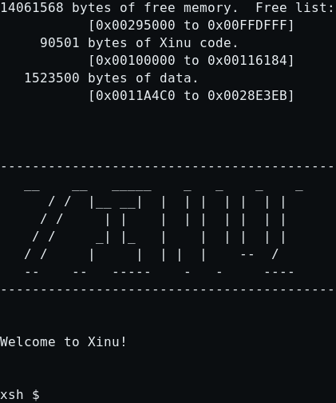
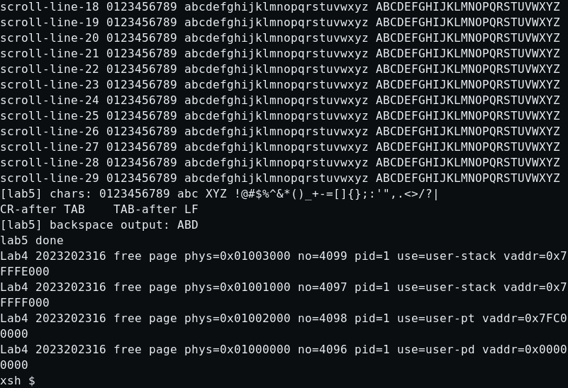
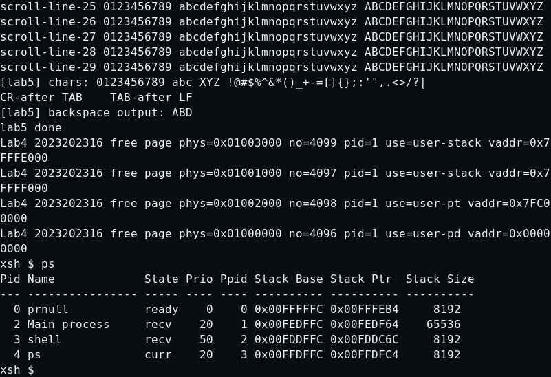
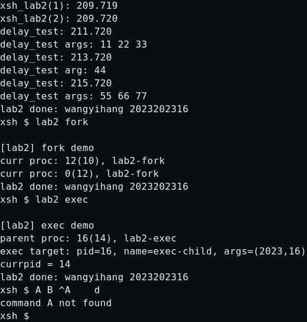
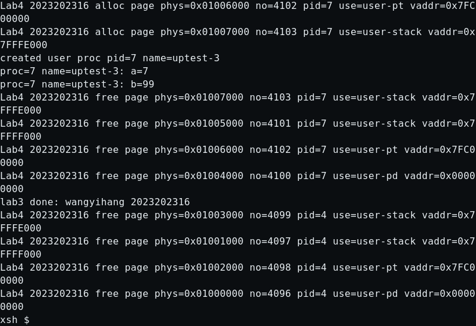
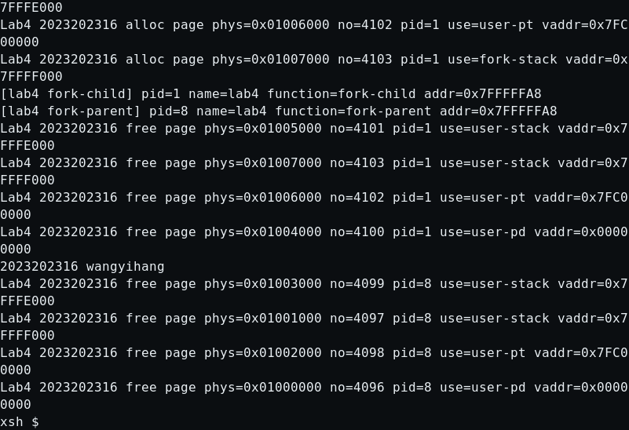
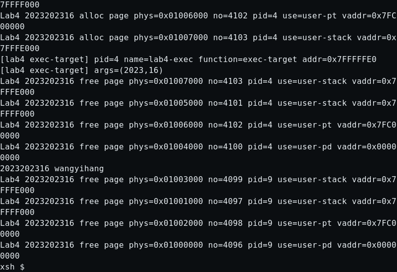
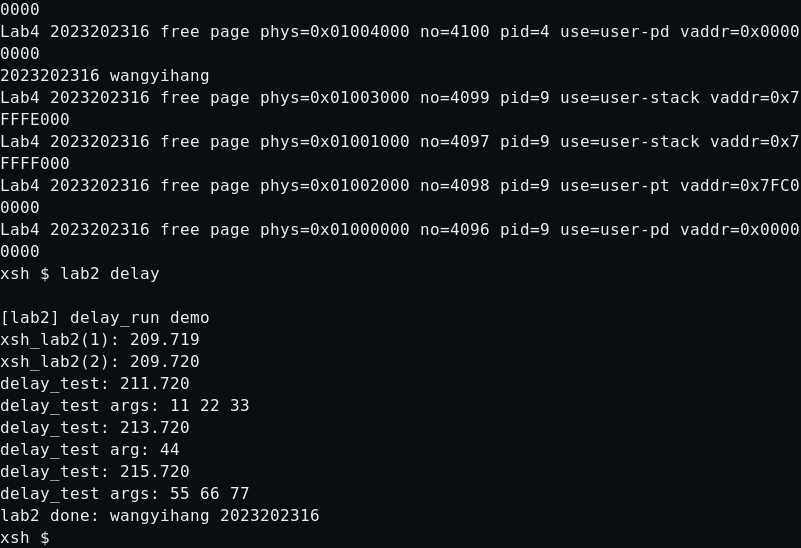
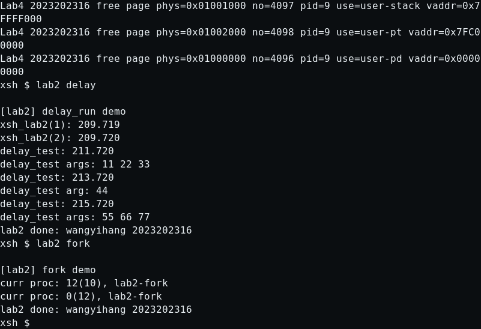
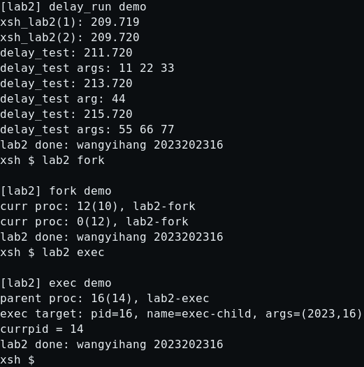

# 实验 5：键盘与文本模式显示器驱动设计与实现

<div style="text-align:center">
    王艺杭（wangyihang）<br>
    2023202316
</div>

---

## 实验目的

本实验选择完成“键盘与文本模式显示器驱动”方向，在前四次实验已经实现用户态、系统调用和页式内存管理的基础上，为 Xinu 增加 VGA 文本模式输出和 PS/2 键盘输入能力，使系统启动、shell 交互、`ps` 命令以及实验 3、实验 4 的用户态命令都可以在 QEMU 的显示器界面中完成。

主要目标包括：

- 实现一个新的键盘 + VGA 文本模式控制台设备。
- 将 `CONSOLE` 从原串口 tty 切换为 VGA 屏幕和 PS/2 键盘。
- 支持 shell 启动标识、提示符、命令输入和命令输出都显示在 VGA 第一屏。
- 实现运行在用户态虚拟内存环境下的 `lab5` 命令。
- 支持实验要求中的特殊按键、特殊字符、长行输出、滚屏和退格。
- 保持实验 3 的 `lab3` 和实验 4 的 `lab4` 命令在 VGA 显示器中正常运行。

---

## 新增文件与修改文件概览

### 新增文件

| 文件 | 作用 |
| --- | --- |
| `include/Lab5.h` | 定义 VGA 常量、键盘输入缓冲区大小、Tab 宽度、`struct k2023202316_kbdvga_cblk` 控制块，以及 Lab5 设备函数声明。 |
| `include/kbd.h` | 保存实验提供的键盘扫描码资料，包括 PS/2 键盘端口常量、Shift/Ctrl/CapsLock 状态位、特殊键码和扫描码映射表。 |
| `system/Lab5.c` | 实现 VGA 文本模式输出、光标控制、滚屏、ANSI 颜色子集、PS/2 键盘扫描码转换、输入回显、退格、Tab 和 cooked line 输入缓冲。 |
| `system/Lab5_dispatch.S` | 实现键盘 IRQ1 中断入口 `k2023202316_kbddisp`，调用 C 层键盘处理函数，并在从用户态中断返回前恢复用户数据段。 |
| `shell/xsh_lab5.c` | 实现实验 5 shell 命令 `xsh_lab5`，用于验证用户态、虚拟内存、参数传递、长行、滚屏、符号和特殊字符输出。 |

### 修改过的原有文件

| 文件 | 修改内容 |
| --- | --- |
| `config/Configuration` | 新增 `kbdvga` 设备类型；将 `CONSOLE` 定义为 `kbdvga`，IRQ 号为 `33`；保留原串口 tty 为 `SERIAL0`。 |
| `config/config.y` | 将配置生成器支持的函数符号最大长度从 16 调整为 32，使 `conf.c` 可以直接引用带学号前缀的 Lab5 设备函数名。 |
| `include/xinu.h` | 引入 `Lab5.h`，使 Lab5 的设备函数和控制块声明对内核其他文件可见。 |
| `include/shprototypes.h` | 增加 `xsh_lab5` 的 shell 命令声明。 |
| `shell/shell.c` | 在 `cmdtab` 中注册 `lab5` 命令，并让 `lab5` 与 `lab3`、`lab4` 一样通过 `k2023202316_create_user_proc()` 作为用户态虚拟内存进程运行。 |
| `system/kprintf.c` | 当当前 `CONSOLE` 的 `putc/getc` 是 Lab5 VGA/键盘设备函数时，内核早期 `kputc/kgetc` 走 VGA 和 PS/2 键盘的 polled 路径，而不是访问 UART 寄存器。 |
| `system/kill.c` | 用户态进程退出时先释放页目录、页表、用户栈和用户堆，再向父进程发送退出消息，避免 shell 提示符和释放日志交错显示。 |

---

## 特殊按键与特殊字符支持情况

实验要求中明确提到的特殊按键和特殊字符均已处理，具体如下：

| 项目 | 支持情况 | 实现位置与处理方式 |
| --- | --- | --- |
| CapsLock | 支持 | `system/Lab5.c` 中 `k2023202316_kbd_translate()` 根据 `togglecode[]` 翻转 `CAPSLOCK` 状态，并在得到字母后切换大小写。 |
| Shift | 支持 | `k2023202316_kbd_translate()` 根据 `shiftcode[]` 维护 `SHIFT` 状态；按下 Shift 后使用 `shiftmap[]` 转换字母和符号。 |
| Ctrl + 字母 | 支持 | 按下 Ctrl 后使用 `ctlmap[]` 得到控制字符；不可打印控制字符在屏幕上回显为 `^A` 这类可见形式，同时原控制字符进入输入缓冲。 |
| Tab | 支持 | 输出时扩展为空格直到 8 列边界；输入时保存为 `\t`，同时记录本次回显宽度，保证退格可以一次删除整个 Tab 的显示宽度。 |
| 回车 | 支持 | 键盘回车统一转换为 `\n`，回显换行，并通过信号量释放整行 cooked input，供 shell 的 `read()` 读取。 |
| Backspace / Ctrl+H | 支持 | `k2023202316_kbd_erase_input()` 只删除当前输入行中已经进入缓冲区的字符；空输入处继续退格不会破坏 `xsh $` 提示符。 |
| `\r` | 支持 | VGA 输出中把当前列号清零，即回到当前行行首。 |
| `\n` | 支持 | VGA 输出中进入下一行；当行号超过 25 行时执行上滚一行。 |
| `\t` | 支持 | VGA 输出中扩展为空格直到 8 列边界。 |
| `\b` / `DEL` | 支持 | VGA 输出中删除光标前一格字符；`lab5` 命令使用 `ABC\b \bD` 验证退格显示效果。 |

此外，本实现支持 shell 默认标识中的 ANSI 颜色控制序列。`include/shell.h` 中的 XINU 标识以 `\033[31;1m` 开头、以 `\033[0m` 结束；VGA 驱动解析 `ESC [ ... m` 中的 `31` 和 `0`，因此启动标识可以在 VGA 中以红色显示。未实现实验扩展项中的串口和 VGA 双屏同步输入输出，也没有实现左右方向键编辑；方向键等 E0 特殊键会被识别为特殊键码后忽略，避免破坏普通 shell 行输入。

---

## 总体设计

本实验没有改造原 tty 驱动，而是新增一个独立设备类型 `kbdvga`。设备配置如下：

```text
kbdvga:
    on pc
        -i k2023202316_kbdvgainit
        -r k2023202316_kbdvgaread
        -g k2023202316_kbdgetc
        -p k2023202316_vgaputc
        -w k2023202316_kbdvgawrite
        -n k2023202316_kbdvgactl
        -intr k2023202316_kbddisp

CONSOLE is kbdvga on pc csr 0x0000 -irq 33
SERIAL0 is tty on uart csr 0001770 -irq 0044
```

`CONSOLE` 直接使用 `kbdvga`，因此 shell 进程启动后传入的标准输入输出设备就是 VGA + PS/2 键盘。原串口 tty 保留为 `SERIAL0`，用于保留原设备定义，但本实验默认交互不再依赖串口。

总体数据流如下：

1. 系统初始化时根据 `config/Configuration` 创建 `CONSOLE` 设备。
2. `k2023202316_kbdvgainit()` 清屏、初始化输入缓冲区和信号量，设置 IRQ1 中断向量。
3. shell 使用 `fprintf(dev, ...)` 输出 XINU 标识和提示符，最终进入 `k2023202316_vgaputc()`，写入 VGA 文本显存。
4. 用户按键触发 IRQ1，`k2023202316_kbddisp` 进入 `k2023202316_kbdhandler()`。
5. 键盘处理函数读取 PS/2 数据端口，完成扫描码转换、输入回显和行缓冲。
6. shell 调用 `read(CONSOLE, ...)` 时，`k2023202316_kbdgetc()` 通过信号量等待一整行输入。
7. `lab3`、`lab4`、`lab5` 等用户态命令通过系统调用输出字符，最终仍然写到 `CONSOLE`，因此显示在 VGA 屏幕。

核心控制块定义在 `include/Lab5.h`：

```c
struct k2023202316_kbdvga_cblk {
  char *ihead;
  char *itail;
  char ibuff[K2023202316_KBD_IBUFLEN];
  uint8 iwid[K2023202316_KBD_IBUFLEN];
  uint8 irow[K2023202316_KBD_IBUFLEN];
  uint8 icol[K2023202316_KBD_IBUFLEN];
  sid32 isem;
  int32 icursor;
  int32 row;
  int32 col;
  uint8 attr;
  uint8 ansi_state;
  uint8 ansi_len;
  char ansi_buf[16];
  uint32 shift;
  bool8 initialized;
  bool8 sem_ready;
};
```

其中 `ibuff` 是输入环形缓冲区，`ihead/itail` 分别指向读取和写入位置；`iwid/irow/icol` 记录每个输入字符在屏幕上的显示宽度和起始位置，用于处理 Tab、控制字符和跨行输入的退格；`isem` 用来实现 shell 所需的阻塞读取；`row/col/attr` 保存当前 VGA 光标和显示属性；`shift` 保存 Shift、Ctrl、Alt、CapsLock 和 E0 扫描码前缀状态。

---

## VGA 文本模式输出

### 显存布局与光标

本实验使用标准 VGA 文本模式，显存基址为 `0xB8000`，屏幕大小为 80 列 × 25 行。每个字符单元占 2 字节：低 8 位为字符，高 8 位为颜色属性。因此写入一个字符的基本形式是：

```c
vga[row * 80 + col] = ((uint16)attr << 8) | (uint8)ch;
```

光标通过 VGA CRT 控制器端口 `0x3D4/0x3D5` 设置。`k2023202316_vga_set_cursor()` 将当前 `row/col` 转换为线性位置，然后分别写入低 8 位和高 8 位。

### 字符输出规则

`k2023202316_vga_polled_putc()` 是 VGA 输出的核心函数。它先处理 ANSI 转义状态；如果当前字符不是 ANSI 序列的一部分，再按字符类型执行：

| 字符 | 行为 |
| --- | --- |
| 普通可打印字符 | 写入当前单元格，列号加 1；若超过 80 列则自动换行。 |
| `\r` | 当前列号设为 0，回到行首。 |
| `\n` | 当前列号设为 0，行号加 1。 |
| `\t` | 连续输出空格，直到列号为 8 的倍数。 |
| `\b` / `\177` | 删除光标前一个字符，并把该单元格清为空格。 |

当行号达到 25 时，`k2023202316_vga_scroll()` 会把第 1 行到第 24 行整体复制到第 0 行到第 23 行，最后一行清空，并把当前行固定为第 24 行。这满足实验要求中“一屏填满时支持上滚一行”的要求。

### ANSI 颜色子集

Xinu 原 shell 标识使用 VT100 风格的颜色控制串。为了使启动标识在 VGA 中正常显示，驱动实现了一个最小 ANSI 子集：

- `ESC [ J`：清屏。
- `ESC [ H`：光标回到左上角。
- `ESC [ 0 m`：恢复默认白色属性 `0x07`。
- `ESC [ 31 ... m`：切换为红色属性 `0x0C`。

该实现不追求完整终端模拟，只覆盖 shell banner 和本实验实际使用的控制序列。

---

## PS/2 键盘输入

### 扫描码转换

键盘控制器状态端口为 `0x64`，数据端口为 `0x60`。当状态寄存器的 `KBS_DIB` 位置位时，说明数据端口中有一个扫描码可读。

`include/kbd.h` 提供了实验所需的三类映射表：

- `normalmap[]`：普通按键映射。
- `shiftmap[]`：Shift 状态下的映射。
- `ctlmap[]`：Ctrl 状态下的映射。

`k2023202316_kbd_translate()` 的处理流程为：

1. 若读到 `0xE0`，设置 `E0ESC` 状态，等待下一个扩展扫描码。
2. 若扫描码最高位为 1，表示按键释放，清除对应的 Shift/Ctrl/Alt 状态。
3. 若是按键按下，先更新 Shift/Ctrl/Alt 状态，再根据 Ctrl、Shift 和普通状态选择映射表。
4. 若 CapsLock 处于开启状态，则对字母大小写再做一次翻转。
5. 对方向键等 E0 特殊键返回 `KEY_*` 码，当前行输入逻辑中直接忽略这些功能键。

### 中断处理

`system/Lab5_dispatch.S` 是 IRQ1 的汇编入口。它保存通用寄存器和标志寄存器，将数据段切换到内核数据段，向 PIC 发送 EOI，然后调用 C 函数 `k2023202316_kbdhandler()`。

实验 3/4 中已经支持用户态进程和页式内存管理，因此键盘中断可能发生在 CPL 3。汇编入口在返回前检查被中断代码的 CPL；如果来自用户态，则把 `ds/es/fs/gs` 恢复为用户数据段选择子 `0x2B`，最后执行 `iret`。这样 `lab3/lab4/lab5` 等用户态进程在接收键盘中断后仍能正常返回用户态继续运行。

### 行缓冲与及时回显

本实验采用类似 tty cooked input 的行缓冲模型：普通字符按下后立即回显到屏幕并进入输入缓冲，但不会立刻唤醒 shell；当用户按下回车后，驱动把整行内容通过信号量释放给 `read()`。

主要规则如下：

- 普通可打印字符：写入输入缓冲，立即在 VGA 中显示。
- Tab：输入缓冲保存 `\t`，屏幕显示扩展后的空格，并记录显示宽度。
- Ctrl + 字母：输入缓冲保存控制字符，屏幕显示 `^A` 形式，便于观察。
- Backspace / Ctrl+H：如果当前输入行非空，则从缓冲区尾部删除上一个字符，并根据记录的宽度清除屏幕；如果当前输入行为空，则不做任何事。
- Enter：回显换行，把 `\n` 写入缓冲，并唤醒等待输入的 shell。
- Ctrl+D：在当前输入行为空时产生 EOF，保留 Xinu 原 shell 的退出语义。
- Ctrl+U：清空当前输入行。

为了保证滚屏后退格仍然删除正确位置，`k2023202316_vga_scroll()` 在上滚屏幕时也会同步调整尚未提交输入缓冲中每个字符记录的 `irow`。

---

## `lab5` 用户态命令

`shell/xsh_lab5.c` 中的 `xsh_lab5()` 按实验要求运行在虚拟内存管理模式下的用户态。`shell/shell.c` 中对 `lab3`、`lab4`、`lab5` 特判，使用实验 3/4 中实现的用户态进程创建函数：

```c
child = k2023202316_create_user_proc(cmdtab[j].cfunc, SHELL_CMDSTK,
                                     SHELL_CMDPRIO, cmdtab[j].cname, 2,
                                     ntok, &tmparg);
```

`xsh_lab5()` 启动后先定义局部变量 `x`，并输出进程信息：

```c
int32 x;
pid = u2023202316_getpid();
u2023202316_getpname(pid, pname, sizeof(pname));
u2023202316_printf("xsh_lab5: pid=%d name=%s cpl=%d &x=0x%08X\n",
                   pid, pname, u2023202316_getcpl(), &x);
```

其中 `cpl=3` 用来说明命令确实运行在用户态；`&x` 位于实验 4 设计的用户栈高地址区域，可用于观察用户虚拟地址空间。之后命令逐个输出传入参数，并输出学号和姓名拼音：

```text
arg-0: lab5
arg-1: a
arg-2: b
arg-3: 123
2023202316 wangyihang
```

`lab5` 的显示测试包括：

| 测试函数 | 覆盖要求 |
| --- | --- |
| `u2023202316_lab5_long_line()` | 输出 96 个连续字母，超过 80 列且中间不含 `\n` 或 `\r`，用于验证自动换行。 |
| `u2023202316_lab5_scroll()` | 输出 30 行 `scroll-line-xx`，超过 25 行屏幕高度，用于验证上滚一行。 |
| `u2023202316_lab5_chars()` | 输出数字、大小写字母、符号、`\r`、`\n`、`\t` 和退格效果。 |

由于 `lab5` 作为用户态虚拟内存进程运行，退出时会经过实验 3 的用户态返回路径和实验 4 的地址空间释放逻辑。`system/kill.c` 在发送子进程退出消息前调用 `k2023202316_free_user_space(pid)`，释放用户页目录、用户页表和用户栈页。因此 `lab5` 正常结束后，屏幕上可以看到 Lab4 页释放日志，然后 shell 回到 `xsh $` 提示符。

---

## Shell 与 `ps` 命令接入

### Shell 全流程运行在 VGA 显示器

本实验将 `CONSOLE` 改成 `kbdvga` 后，shell 进程仍然使用原来的 `fprintf(dev, ...)`、`read(dev, ...)` 和 `write(dev, ...)` 逻辑。区别在于 `dev` 对应的设备函数已经换成 Lab5 的 VGA 和键盘函数，所以：

- Xinu 启动后的大号标识输出到 VGA 显存。
- `Welcome to Xinu!` 和 `xsh $` 提示符输出到 VGA。
- 每次按键由 PS/2 键盘中断处理并及时回显到 VGA。
- shell 解析出的命令仍按原流程创建、恢复、等待和回收。

内核早期输出也需要适配。原 `kputc/kgetc` 默认把 `CONSOLE` 当作 UART 设备访问串口寄存器；切换到 VGA 后，如果仍访问 UART 寄存器会出错。因此 `system/kprintf.c` 中增加了设备函数判断：当 `CONSOLE` 的 `dvputc` 是 `k2023202316_vgaputc` 时，`kputc()` 调用 `k2023202316_vga_polled_putc()`；当 `dvgetc` 是 `k2023202316_kbdgetc` 时，`kgetc()` 调用 `k2023202316_kbd_polled_getc()`。

### `ps` 命令

`ps` 命令本身主要通过标准输出打印进程表。由于本实验已经把 shell 子进程的标准输出描述符设置为当前 VGA `CONSOLE`，所以无需重写 `xsh_ps.c` 的进程表逻辑，`ps` 的输出路径自然变为：

```text
xsh_ps -> printf/fprintf -> write(CONSOLE) -> k2023202316_kbdvgawrite()
       -> k2023202316_vgaputc() -> VGA text memory
```

多次执行 `ps` 时，输出超过一屏后由 VGA 驱动滚屏；之后继续在提示符处输入长命令，也会按 80 列自动换行。空输入状态下继续退格不会删除提示符，因为退格只作用于当前输入行缓冲区中的字符。

---

## 兼容实验 3 和实验 4

实验要求 2.4 要求 `lab3` 和 `lab4` 能够在 VGA 显示器中正常运行。本实现保持了实验 3/4 的用户态进程创建、系统调用和分页机制，只改变控制台设备，因此兼容性主要来自以下几点：

1. `shell/shell.c` 继续把 `lab3`、`lab4`、`lab5` 作为用户态进程创建。
2. 用户态 `u2023202316_printf()` 通过 `int 0x80` 请求内核输出字符，内核最终写入当前 `CONSOLE`。
3. `CONSOLE` 已经切换为 VGA 设备，所以用户态输出显示在 VGA 屏幕。
4. 键盘中断汇编入口支持从 CPL 3 返回，避免用户态进程被外部中断打断后段寄存器错误。
5. 用户态进程退出时继续由实验 4 的 `k2023202316_free_user_space()` 释放用户地址空间。

实际测试中，`lab3` 能正常输出用户态进程名称、CPL 和 `uptest` 子进程结果；`lab4 1` 能完成 fork 测试；`lab4 2` 能完成 fork 后 exec 到新入口函数的测试，并且结束后返回 VGA shell 提示符。

---

## 测试方法与结果

### 编译测试

在 `compile` 目录执行：

```bash
make clean && make
```

编译成功，能够生成 `compile/xinu.elf`。

### QEMU 运行方式

由于实验 5 要求使用 QEMU 的显示器界面，本实验不再使用 `-nographic` 作为默认运行方式。测试命令为：

```bash
qemu-system-i386 -kernel compile/xinu.elf
```

自动化验证时，也使用过 QEMU monitor 的 `sendkey` 向虚拟 PS/2 键盘发送按键，并用：

```text
pmemsave 0xb8000 4000 "/tmp/xinu_vga_*.bin"
```

保存 VGA 文本缓冲区，再按 80 × 25 的字符单元解码检查屏幕内容。

### 启动与 shell 显示



图中可以看到 Xinu 启动信息、红色 XINU 标识、欢迎信息和 `xsh $` 提示符均出现在 VGA 显示器界面，说明 `CONSOLE` 已经切换为 `kbdvga`，并且 shell 的输出路径正确。

### `lab5 a b 123` 输出测试



测试命令为：

```bash
lab5 a b 123
```

该命令验证了以下内容：

- `xsh_lab5` 能作为用户态虚拟内存进程启动并输出 `cpl=3`。
- 参数 `lab5`、`a`、`b`、`123` 能按字符串形式输出。
- 局部变量地址位于用户栈虚拟地址范围。
- 长行超过 80 列后自动换行。
- 30 行滚屏测试超过 25 行屏幕高度后能上滚。
- 数字、大小写字母和各种符号能够正常显示。
- `\r`、`\n`、`\t` 和退格输出符合预期。
- 命令结束后出现 Lab4 页释放日志，说明页目录、页表和用户栈被释放，随后回到 `xsh $` 提示符。

### `ps` 命令显示测试



`ps` 命令能在 VGA 中输出进程表。多次执行 `ps` 时屏幕内容超过 25 行后由 VGA 驱动滚屏，最后仍然回到 shell 提示符。该测试说明普通内核态 shell 命令也能通过新的 `CONSOLE` 输出到显示器。

### 特殊按键、长输入和退格测试



测试按键序列包括：

```text
CapsLock + a
Shift + B
Ctrl + A
Tab
c
Backspace
d
Enter
```

屏幕回显结果为：

```text
A B ^A    d
```

其中：

- `CapsLock + a` 回显为 `A`。
- `Shift + B` 回显为 `B`。
- `Ctrl + A` 回显为 `^A`。
- `Tab` 回显为空格并对齐到 8 列边界。
- 输入 `c` 后按 Backspace，`c` 被删除。
- 最终输入 `d` 并回车，shell 按该命令行继续处理，并返回提示符。

空输入处继续退格时，驱动发现当前输入行缓冲为空，不删除屏幕内容，因此不会破坏 `xsh $` 提示符。长输入超过 80 列时，普通字符输出逻辑会自动换行；若输入尚未提交且发生滚屏，驱动会同步调整输入字符记录的行号，使后续退格仍能删除正确位置。

### 实验 3 兼容性



执行 `lab3` 后，命令能在 VGA 中输出用户态进程 PID、进程名、CPL 和多个 `uptest` 子进程结果，最后正常回到 shell。这说明实验 3 的用户态入口、系统调用和用户态进程退出机制在 VGA 控制台下仍然正常。

### 实验 4 fork 兼容性



执行：

```bash
lab4 1
```

可以看到 fork 前后的父子进程输出和用户态上下文信息，命令结束后用户空间被释放并返回 shell，说明分页环境下的 fork 测试仍然兼容 VGA 控制台。

### 实验 4 exec 兼容性



执行：

```bash
lab4 2
```

可以看到子进程 fork 后执行 `exec`，进入新入口函数并输出参数。旧用户地址空间被释放，新地址空间被建立，命令最终正常结束并返回 VGA shell。

### 实验 2 回归测试

虽然实验 5 的兼容性要求重点是实验 3 和实验 4，本次也在 VGA 控制台中回归运行了实验 2 的命令，确认早期 fork/exec/delay 测试不会因为控制台切换而失效。







---

## 实验要求对应关系

| 实验要求 | 完成情况 |
| --- | --- |
| 2.1 实现键盘 + 显示器驱动程序 | 已完成。新增 `kbdvga` 设备，使用 VGA 文本显存和 PS/2 键盘 IRQ1。 |
| 2.2-a `xsh_lab5` 运行于虚拟内存管理模式下的用户态 | 已完成。shell 使用 `k2023202316_create_user_proc()` 创建 `lab5`，运行时输出 `cpl=3`。 |
| 2.2-b 输出局部变量地址、参数、学号姓名 | 已完成。`xsh_lab5` 输出 `&x`、所有 `args[]`、`2023202316 wangyihang`。 |
| 2.2-c 正确销毁用户进程内存空间 | 已完成。进程退出时调用 `k2023202316_free_user_space()`，释放日志显示用户页目录、页表和用户栈被回收。 |
| 2.2-d 长行、多行滚屏、数字字母符号和特殊字符 | 已完成。`lab5` 包含长行、30 行滚屏、符号、`\r`、`\n`、`\t`、退格测试。 |
| 2.2-e 非调试状态下 `lab5` 正常结束 | 已完成。测试中 `lab5 a b 123` 结束后回到 `xsh $`。 |
| 2.2-f 输出显示在显示器界面 | 已完成。所有输出均显示在 VGA 文本屏幕。 |
| 2.3-a shell 交互在显示器界面完成 | 已完成。启动标识、欢迎信息、提示符、输入和输出均在 VGA 中显示。 |
| 2.3-b 特殊按键测试 | 已完成。CapsLock、Shift、Ctrl、Tab、Backspace/Ctrl+H 均有处理和截图说明。 |
| 2.3-c `ps` 能运行在显示器界面 | 已完成。`ps` 输出走 VGA `CONSOLE`。 |
| 2.3-d 多次 `ps` 后滚屏 | 已完成。输出超过一屏时由 VGA 驱动滚屏。 |
| 2.3-e 提示符处长输入超过一行 | 已完成。普通字符输出超过 80 列自动换行。 |
| 2.3-f 空输入处继续退格 | 已完成。当前输入行为空时退格不删除提示符。 |
| 2.3-g 提示符位于最后一行时回车 | 已完成。回车触发换行，若超出屏幕则滚屏。 |
| 2.3-h 每次按键及时回显 | 已完成。键盘中断中即时调用 VGA 输出函数回显。 |
| 2.4 `lab3`、`lab4` 在 VGA 中正常运行 | 已完成。`lab3`、`lab4 1`、`lab4 2` 均已测试并截图。 |
| 2.5-b 红色 XINU 标识 | 已完成。实现 ANSI `31m` 与 `0m` 的最小支持。 |

---

## 小结

本实验通过新增 `kbdvga` 设备，把 Xinu 的默认控制台从串口切换到了 VGA 文本模式显示器和 PS/2 键盘。VGA 输出侧实现了普通字符、回车、换行、Tab、退格、光标控制和滚屏；键盘输入侧实现了扫描码转换、Shift/Ctrl/CapsLock 状态维护、及时回显、行缓冲、Tab 宽度记录和安全退格。

在此基础上，`xsh_lab5` 作为用户态虚拟内存进程运行，完成参数、局部变量地址、学号姓名、长行、滚屏和特殊字符测试；shell、`ps`、`lab3`、`lab4` 也都能通过新的 VGA 控制台正常交互。实验 5 要求的必做项已经全部覆盖，红色 XINU 标识作为扩展项也已实现。
