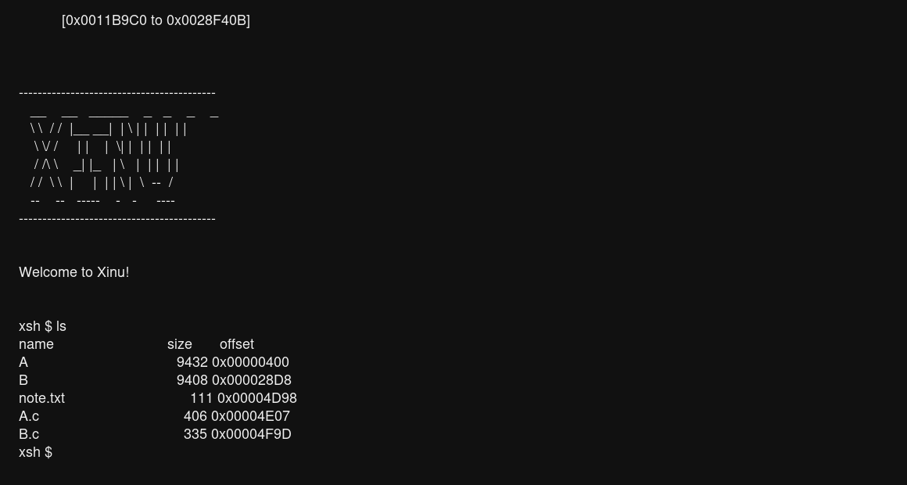
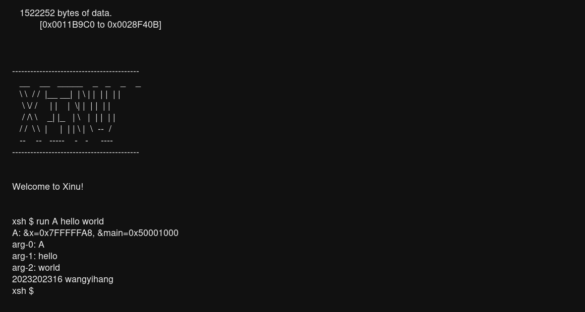
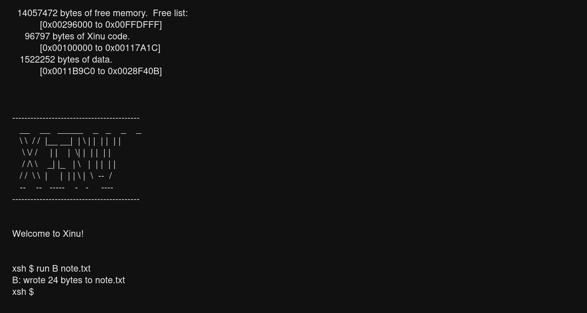

# 实验 6：硬盘读写与外部程序加载

<div style="text-align:center">
    王艺杭（wangyihang）<br>
    2023202316
</div>

---

## 实验目的

本实验选择完成“硬盘读写与外部程序加载”方向。在实验 3 的用户态与系统调用机制、实验 4 的页式虚拟内存机制、实验 5 的 VGA 键盘显示器驱动基础上，为 Xinu 增加一个可通过抽象 I/O 接口访问的 IDE 硬盘设备，并支持从硬盘镜像中的简易文件系统动态加载外部 ELF 用户程序。

本次实现的目标包括：

- 在实验 5 的 VGA 控制台环境下运行实验 6 的 `ls` 和 `run` 命令，不依赖原 tty 串口交互。
- 实现一个主通道从盘 ATA PIO 硬盘驱动，支持 `read()` 和 `write()` 抽象接口。
- 通过硬盘中断完成读写请求，并使用锁保证任意时刻只有一个进程访问硬盘。
- 解析 `fs_util/mkfs.c` 生成的简易文件系统，支持按文件名查找、读取和覆盖写入。
- 在 `fs_util` 中提供至少两个外部用户态程序 A 和 B，并通过 `make` 编译进 `fs.img`。
- 实现 shell 命令 `ls`，列出硬盘镜像中的文件。
- 实现 shell 命令 `run`，通过用户态 `fork` 加外部程序 exec 语义，从硬盘镜像加载 ELF 并传递参数执行。

---

## 运行命令

本实现使用 `fs_util/fs.img` 作为 IDE 主通道从盘，即 `index=1`。

首先在 `fs_util` 目录生成硬盘镜像：

```bash
cd fs_util
make
```

然后在 `compile` 目录编译内核：

```bash
cd ../compile
make
```

最后仍在 `compile` 目录启动 QEMU：

```bash
qemu-system-i386 -kernel xinu.elf \
    -drive file=../fs_util/fs.img,index=1,media=disk,format=raw
```

若从源码根目录启动，等价命令为：

```bash
qemu-system-i386 -kernel compile/xinu.elf \
    -drive file=fs_util/fs.img,index=1,media=disk,format=raw
```

---

## 新增文件与修改文件概览

### 新增文件

| 文件 | 作用 |
| --- | --- |
| `include/Lab6.h` | 定义 Lab6 硬盘控制块、简易文件系统目录项、外部 ELF 地址范围、系统调用号和接口声明。 |
| `include/elf.h` | 保存 ELF 文件头、程序头和 ELF 常量，用于读取外部可执行程序。 |
| `device/lab6hd/hdinit.c` | 初始化硬盘控制块、互斥锁、完成信号量，并设置硬盘中断向量。 |
| `device/lab6hd/hdread.c` | 实现 `read(HD0, buf, lba)`，并包含读写共用的 ATA PIO 传输函数。 |
| `device/lab6hd/hdwrite.c` | 实现 `write(HD0, buf, lba)`。 |
| `device/lab6hd/hdhandler.c` | 硬盘 IRQ14 C 层处理函数，读取状态并唤醒等待进程。 |
| `device/lab6hd/hddisp.S` | 硬盘 IRQ14 汇编入口，发送主片和从片 EOI，并在用户态返回前恢复用户数据段。 |
| `device/lab6hd/hdcontrol.c` | 提供硬盘设备 `control` 入口，目前用于返回错误或保留扩展。 |
| `system/Lab6.c` | 实现硬盘镜像文件系统解析、文件读写、用户态文件写入 syscall、外部 ELF 校验、映射、参数栈构造和 execfile。 |
| `shell/xsh_lab6.c` | 实现 shell 命令 `xsh_lab6_ls` 和 `xsh_lab6_run`，分别注册为 `ls` 和 `run`。 |
| `fs_util/A.c` | 外部用户程序 A，输出局部变量地址、`main` 地址、所有参数和学号姓名。 |
| `fs_util/B.c` | 外部用户程序 B，将固定字符串写入指定文件的起始位置。 |
| `fs_util/userlib.c`、`fs_util/userlib.h` | 外部程序使用的最小用户态库，提供 `int 0x80`、`putc`、`printf`、`exit`、`writefile`。 |
| `fs_util/note.txt` | 硬盘镜像中的普通文本文件，用于 `ls` 展示和程序 B 写入测试。 |

### 修改过的原有文件

| 文件 | 修改内容 |
| --- | --- |
| `config/Configuration` | 新增 `lab6hd` 设备类型；新增 `HD0 is lab6hd on pc csr 0x01f0 -irq 46`，表示 QEMU 中 IDE 主通道从盘。 |
| `compile/Makefile` | 将 `device/lab6hd` 加入 `REBUILDFLAGS`，保证硬盘驱动参与 `xinu.elf` 构建。 |
| `include/xinu.h` | 引入 `Lab6.h` 和 `elf.h`。 |
| `include/Lab4.h` | 暴露 `k2023202316_map_user_region()` 和 `k2023202316_reset_user_space()` 等 Lab6 装载外部 ELF 需要复用的虚拟内存接口。 |
| `system/Lab4_vm.c` | 增加通用用户页区域映射函数，调整释放逻辑，使外部 ELF 映射页能随进程退出释放。 |
| `include/shprototypes.h` | 增加 `xsh_lab6_ls` 和 `xsh_lab6_run` 声明。 |
| `shell/shell.c` | 注册 `ls` 和 `run` 命令；其中 `run` 与 `lab3/lab4/lab5` 一样作为用户态命令创建。 |
| `system/Lab3_syscall.c` | 增加 `K2023202316_SYS_WRITEFILE` 和 `K2023202316_SYS_EXECFILE` 的系统调用分发。 |
| `system/Lab3_userlib.c` | 增加 `u2023202316_writefile()` 和 `u2023202316_execfile()` 用户态封装。 |
| `system/read.c`、`system/write.c` | 对 `HD0` 特判，避免通用 I/O 包装层在调用硬盘驱动期间一直关闭中断。 |
| `fs_util/Makefile` | 增加 A/B 外部程序编译规则，把 `A`、`B`、`note.txt`、`A.c`、`B.c` 放入 `fs.img`。 |

---

## 实验要求对应关系

| 实验要求 | 实现位置 | 完成情况 |
| --- | --- | --- |
| 2.1 硬盘驱动和简易文件系统，实验 5 环境下运行 | `device/lab6hd/*`、`system/Lab6.c`、`config/Configuration` | `CONSOLE` 仍为 Lab5 的 VGA 键盘设备，`ls` 和 `run` 在 VGA shell 中运行。 |
| 2.2-a 通过 Xinu 抽象 I/O 接口调用驱动 | `system/Lab6.c` | 文件系统只调用 `read(HD0, ...)` 和 `write(HD0, ...)`，不直接调用驱动内部函数。 |
| 2.2-b 支持 `read` 和 `write` | `hdread.c`、`hdwrite.c` | `read(HD0, buf, lba)` 读取一个 512 字节扇区，`write(HD0, buf, lba)` 写入一个 512 字节扇区。 |
| 2.2-c 说明 `read/write` 参数语义 | 驱动代码注释、本报告“硬盘驱动设计” | 第 3 个参数沿用块设备习惯解释为 LBA 扇区号。 |
| 2.2-d 硬盘中断处理 | `hddisp.S`、`hdhandler.c`、`hdread.c` | 请求发出后等待 `done` 信号量，由 IRQ14 处理函数唤醒。 |
| 2.2-e 硬盘读写保护 | `k2023202316_hd.lock` | 每次读写前 `wait(lock)`，结束后 `signal(lock)`，保证互斥。 |
| 2.2-f 驱动在 `device` 目录并被编译 | `device/lab6hd/`、`compile/Makefile` | 已加入构建目录。 |
| 2.3 A/B 两个用户态测试程序 | `fs_util/A.c`、`fs_util/B.c` | A 输出地址、参数、学号姓名；B 覆盖写入指定文件。 |
| 2.3 A/B 通过 syscall 与内核交互 | `fs_util/userlib.c`、`system/Lab3_syscall.c` | A/B 使用 `int 0x80` 输出和写文件。 |
| 2.3 A/B 不编译进 `xinu.elf` | `fs_util/Makefile` | A/B 编译为外部 ELF 并放入 `fs.img`。 |
| 2.4 `ls` 命令 | `shell/xsh_lab6.c`、`system/Lab6.c` | `ls` 列出文件名、大小和镜像偏移。 |
| 2.5 `run` 命令 | `shell/xsh_lab6.c`、`system/Lab6.c` | `run` 接收程序名和参数，从镜像加载 ELF 并在用户态执行。 |
| 2.5-e 读写硬盘通过抽象 I/O | `k2023202316_fs_read_bytes()`、`k2023202316_fs_write_bytes()` | 只调用 `read(HD0, ...)`、`write(HD0, ...)`。 |
| 2.5-f 通过 fork 和 exec 完成外部命令 | `xsh_lab6_run()`、`u2023202316_execfile()` | `run` 先 `fork`，子进程执行 `execfile`。`execfile` 是对实验 4 `exec` 语义的扩展，用文件名替代内核函数指针。 |

---

## 硬盘驱动设计

### 设备配置

本实验新增设备类型 `lab6hd`：

```text
lab6hd:
    on pc
        -i k2023202316_hdinit
        -r k2023202316_hdread
        -w k2023202316_hdwrite
        -n k2023202316_hdcontrol
        -intr k2023202316_hddisp

HD0 is lab6hd on pc csr 0x01f0 -irq 46
```

`csr 0x01f0` 对应 IDE 主通道命令端口组；QEMU 启动命令中使用 `index=1`，因此镜像挂载为主通道从盘。配置中的 `-irq 46` 对应 Xinu 中断向量号，物理硬盘中断为 IRQ14。

### `read` 和 `write` 的参数语义

驱动把 Xinu 抽象 I/O 的第 3 个参数解释为扇区号：

```c
read(HD0, buf, lba)
write(HD0, buf, lba)
```

其中：

- `HD0` 是硬盘设备号。
- `buf` 指向 512 字节缓冲区。
- `lba` 是 LBA28 扇区号。

一次调用只读写一个 512 字节扇区。文件系统层如果要读写任意字节范围，会先计算起始扇区、扇区内偏移和本次拷贝长度；写入不足一个扇区时，采用“先读整扇区、修改局部字节、再写回整扇区”的方式避免破坏同扇区其他文件内容。

### ATA PIO 访问流程

`k2023202316_hd_xfer()` 是读写共用函数，主要步骤如下：

1. 检查缓冲区和硬盘是否存在。
2. `wait(k2023202316_hd.lock)` 获取硬盘互斥锁。
3. 等待 ATA 状态寄存器满足 `!BSY && RDY`。
4. 设置从盘选择、扇区数、LBA 低中高 24 位。
5. 读操作发送 `0x20` 命令，写操作发送 `0x30` 命令。
6. 当前进程等待 `k2023202316_hd.done`。
7. IRQ14 到来后，中断处理函数读取状态寄存器、记录错误状态并 `signal(done)`。
8. 读操作在中断完成后从 `0x1F0` 数据端口读取 256 个 16 位数据；写操作则在发送命令并确认 DRQ 后向数据端口写入 256 个 16 位数据，再等待完成中断。
9. 释放互斥锁并返回 `OK` 或 `SYSERR`。

### 中断处理

汇编入口 `k2023202316_hddisp` 做三件事：

1. 保存通用寄存器和标志寄存器。
2. 切换到内核数据段，向从片和主片 PIC 发送 EOI。
3. 调用 C 函数 `k2023202316_hdhandler()`。

`k2023202316_hdhandler()` 读取 `0x1F7` 状态寄存器。如果出现 `ERR` 或 `DF`，设置 `k2023202316_hd.error = TRUE`。如果当前有进程正在等待硬盘完成，则清除 `waiting` 并 `signal(k2023202316_hd.done)`。

由于硬盘中断可能打断用户态外部程序，`hddisp.S` 在返回前会检查被中断代码的 CPL。如果原先来自用户态，则把 `ds/es/fs/gs` 恢复为用户数据段选择子 `0x2B`，再执行 `iret`。

### 为什么修改 `read.c` 和 `write.c`

Xinu 原有 `read()` 和 `write()` 会在进入设备函数前关闭中断，并在设备函数返回后恢复中断。这个模式适合普通同步设备，但不适合本实验的硬盘驱动，因为硬盘驱动发出请求后需要等待 IRQ14 到来。如果中断一直被通用 I/O 包装层关闭，等待进程永远不会被硬盘中断唤醒。

因此 `system/read.c` 和 `system/write.c` 对 `HD0` 做了特判：完成设备号合法性检查和设备表查找后，先 `restore(mask)`，再调用硬盘驱动函数。这样既保留了通用检查，又允许硬盘驱动内部短时间关中断、随后打开中断等待 IRQ14。

---

## 简易文件系统设计

### 镜像内容

`fs_util/Makefile` 当前放入镜像的文件为：

```makefile
FS_FILES = A \
           B \
           note.txt \
           A.c \
           B.c
```

其中 `A` 和 `B` 是可执行外部 ELF；`note.txt`、`A.c`、`B.c` 是普通文本文件。`note.txt` 用于程序 B 的写入测试，`A.c` 和 `B.c` 同时满足“镜像中至少包含一个纯文本文件”的要求。

### 目录格式

实验提供的 `mkfs.c` 使用如下目录项格式：

```c
struct _dir {
    size_t offset;
    size_t size;
    char name[128];
};
```

第 0 个目录项的 `size` 字段保存文件数量。第 1 个目录项开始依次保存每个文件在镜像中的偏移、大小和名称。

需要注意的是，`mkfs` 是宿主机程序。如果在 64 位 Linux 上编译，`size_t` 为 8 字节，目录项大小为 144 字节；如果在 32 位环境中编译，`size_t` 为 4 字节，目录项大小为 136 字节。为了提高可移植性，内核中的 `k2023202316_fs_format()` 同时尝试这两种布局：

- 从第 0 项偏移 4 字节处读取 32 位文件数，若合理则使用 136 字节目录项。
- 从第 0 项偏移 8 字节处读取 32 位文件数，若合理则使用 144 字节目录项。

本次测试环境中使用 64 位宿主机编译 `mkfs`，因此实际目录项大小为 144 字节。

### 文件读写接口

文件系统层提供四个主要接口：

| 函数 | 作用 |
| --- | --- |
| `k2023202316_fs_list()` | 打印镜像中所有文件的名称、大小和偏移。 |
| `k2023202316_fs_find(name, out)` | 按文件名查找目录项，支持忽略路径开头的 `/`。 |
| `k2023202316_fs_read(name, off, buf, count)` | 从指定文件内偏移读取最多 `count` 字节。 |
| `k2023202316_fs_write(name, off, buf, count)` | 从指定文件内偏移覆盖写入最多 `count` 字节。 |

`fs_write` 不扩展文件大小。如果写入长度超过文件剩余空间，会截断到文件末尾。这符合程序 B 的测试场景：向已存在文件 `note.txt` 的起始位置写入一小段固定字符串。

---

## 外部 ELF 装载设计

### 外部程序地址布局

实验 4 中已经使用：

- 用户堆：`0x40000000-0x40400000`
- 用户栈顶：`0x80000000`

本实验将外部 ELF 映射到：

```c
#define K2023202316_ELF_BASE  0x50000000
#define K2023202316_ELF_LIMIT 0x70000000
```

`fs_util/Makefile` 把 A 和 B 的入口链接到 `0x50001000`：

```makefile
LDFLAGS32 = -m elf_i386 -e main -Ttext 0x50001000
```

这样外部程序代码、只读数据和数据段都处于用户虚拟地址空间中，且避开用户堆和用户栈。测试输出中 A 的 `&main=0x50001000`，说明外部程序确实从该区域运行。

### `run` 的 fork + execfile 流程

实验要求 `run` 通过用户态系统调用 `fork` 和 `exec` 完成外部命令加载。原实验 4 的 `exec` 接口接收的是内核内已有函数指针，不适合直接表达“从硬盘中的某个文件名加载 ELF”。因此本实验在保持 fork/exec 模式的基础上新增了 `execfile` 系统调用：

```c
pid = u2023202316_fork();
if (pid == 0) {
    u2023202316_execfile(args[1], nargs - 1, &args[1]);
    u2023202316_exit();
}
```

语义上，`execfile` 与实验 4 的 `exec` 一样不会创建新进程，而是在当前 fork 出来的子进程上下文中替换用户地址空间、入口地址和用户栈；区别只是目标程序由“内核函数地址”变为“硬盘镜像中的 ELF 文件名”。

父进程通过 `u2023202316_receive()` 等待子进程退出，避免 shell 提示符过早出现。

### 内核装载流程

`u2023202316_execfile()` 进入内核后由 `k2023202316_execfile_from_user()` 处理。完整流程如下：

1. 从用户态复制目标文件名。
2. 从用户态复制 `argc` 和 `argv` 指针数组，再逐个复制参数字符串。
3. 调用 `k2023202316_fs_find()` 查找目标文件，读取完整 ELF 到内核临时缓冲区。
4. 校验 ELF magic、程序头大小、程序头范围、入口地址范围。
5. 校验每个 `ELF_PROG_LOAD` 段的 `filesz <= memsz`，文件内偏移不越界，虚拟地址落在 `0x50000000-0x70000000`。
6. 调用 `k2023202316_reset_user_space(currpid)` 清理子进程旧用户堆、栈、旧 ELF 映射等用户页。
7. 对每个 loadable segment，按页调用 `k2023202316_map_user_region()` 映射用户页。
8. 调用 `k2023202316_copy_to_user()` 把 ELF 文件中的段内容复制到用户虚拟地址。
9. 在用户栈顶向下构造参数字符串、`argv[]` 数组、`argc`、`argv` 指针和返回地址 `u2023202316_exit`。
10. 修改系统调用 trapframe：`tf->eip = entry`，`tf->useresp = newsp`。
11. 系统调用返回后，汇编恢复 trapframe，子进程直接从外部 ELF 入口继续在用户态执行。

如果文件不存在、不是 ELF、入口地址不在外部程序区域，或者段映射失败，则 `execfile` 返回 `SYSERR`。此时 `run` 子进程输出 `run: cannot exec <name>` 并退出。本实现测试时故意输入过 `run a hello world`，因为镜像中文件名是大写 `A`，输出了错误提示，说明错误路径可正常退出。

---

## 外部用户程序 A 和 B

### 外部程序编译方式

`fs_util/Makefile` 使用如下 32 位编译参数：

```makefile
CFLAGS32 = -m32 -fno-builtin -fno-stack-protector -fno-pic -nostdlib -O0 -Wall
LDFLAGS32 = -m elf_i386 -e main -Ttext 0x50001000
```

`-nostdlib` 表示外部程序不依赖宿主机 C 标准库，只链接 `fs_util/userlib.o`。`userlib.c` 自己实现最小 `printf`，并通过 `int 0x80` 调用内核系统调用。

### 程序 A

程序 A 的源码位于 `fs_util/A.c`。它实现以下功能：

1. 定义局部变量 `x` 并输出 `&x`。
2. 输出 `&main`，用于证明外部程序入口地址。
3. 遍历 `argc/argv`，按 `arg-0`、`arg-1` 等格式输出所有参数。
4. 输出 `2023202316 wangyihang`。

执行：

```text
run A hello world
```

期望输出包括：

```text
A: &x=0x7FFFFFA8, &main=0x50001000
arg-0: A
arg-1: hello
arg-2: world
2023202316 wangyihang
```

其中 `arg-0` 为程序名本身，符合普通桌面程序的参数约定。

### 程序 B

程序 B 的源码位于 `fs_util/B.c`。它接收一个文件名参数，并把固定字符串：

```text
Lab6-B wrote this text.
```

写入目标文件起始位置。它调用的是外部用户库中的：

```c
u2023202316_writefile(argv[1], msg, sizeof(msg) - 1);
```

该函数进入内核后由 `k2023202316_user_write_file()` 复制用户态文件名和用户态缓冲区，再调用文件系统层 `k2023202316_fs_write()` 完成覆盖写入。测试使用：

```text
run B note.txt
```

运行后输出：

```text
B: wrote 24 bytes to note.txt
```

QEMU 退出后在宿主机检查 `fs_util/fs.img` 的 `note.txt` 偏移处，能够看到文件开头被覆盖为 `Lab6-B wrote this text.\n`。

---

## `ls` 命令实现

`shell/xsh_lab6.c` 中的 `xsh_lab6_ls()` 对应 shell 命令 `ls`。它只接受命令本身一个参数，随后调用 `k2023202316_fs_list()`。

输出列包括：

- 文件名。
- 文件大小。
- 文件在硬盘镜像内的字节偏移。

测试中 `ls` 输出：

```text
name                             size       offset
A                                      9432 0x00000400
B                                      9408 0x000028D8
note.txt                                111 0x00004D98
A.c                                     406 0x00004E07
B.c                                     335 0x00004F9D
```

实际大小会随编译器和源码小幅变化，但文件名、偏移解析和格式与截图一致。

---

## 测试结果

### 编译测试

执行：

```bash
cd fs_util
make clean && make
```

生成过程包括：

- 编译 `mkfs`。
- 以 32 位方式编译 `A.o`、`B.o`、`userlib.o`。
- 链接外部 ELF `A` 和 `B`，入口地址为 `0x50001000`。
- 执行 `./mkfs fs.img A B note.txt A.c B.c` 生成硬盘镜像。

随后执行：

```bash
cd ../compile
make
```

能够成功链接生成 GRUB bootable `xinu.elf`。

### `ls`



执行 `ls` 后，硬盘镜像中的 `A`、`B`、`note.txt`、`A.c`、`B.c` 均被列出，并显示大小和镜像偏移。该测试验证了：

- QEMU 正确加载 `fs_util/fs.img` 为 `HD0`。
- ATA 读扇区路径可用。
- `fs_util` 简易文件系统目录解析正确。
- `ls` 命令可以在实验 5 的 VGA shell 中运行。

### `run A hello world`



执行 `run A hello world` 后，外部程序 A 从硬盘镜像中载入并在用户态执行。输出中：

```text
A: &x=0x7FFFFFA8, &main=0x50001000
arg-0: A
arg-1: hello
arg-2: world
2023202316 wangyihang
```

其中：

- `&main=0x50001000` 与 `fs_util/Makefile` 中的链接地址一致，说明运行的是外部 ELF，而不是内核内置函数。
- `&x=0x7FFFFFA8` 位于用户栈区域，说明外部程序拥有自己的用户栈。
- 参数从 `arg-0` 开始，且 `arg-0` 是程序名 `A`，说明 `run` 对参数的传递符合要求。

### `run B note.txt`



执行 `run B note.txt` 后，程序 B 输出：

```text
B: wrote 24 bytes to note.txt
```

QEMU 退出后检查镜像中 `note.txt` 起始位置，结果为：

```text
00004d98: 4c 61 62 36 2d 42 20 77 72 6f 74 65 20 74 68 69  Lab6-B wrote thi
00004da8: 73 20 74 65 78 74 2e 0a                          s text..
```

说明用户态外部程序 B 通过 syscall 请求内核写文件，内核再通过文件系统层和硬盘 `write(HD0, ...)` 把数据写回了 `fs.img`。

### 错误路径测试

由于文件系统按文件名精确匹配，镜像中程序名为大写 `A`。执行：

```text
run a hello world
```

会输出：

```text
run: cannot exec a
```

该测试验证了目标文件不存在时，`execfile` 会返回错误，`run` 子进程能够输出错误并正常退出，不会破坏 shell。

---

## 与前序实验的关系

本实验依赖前序实验的以下机制：

- 实验 3：用户态系统调用入口 `int 0x80`，用户态 `printf`、`exit`、`receive` 等封装。
- 实验 4：独立用户地址空间、`fork`、trapframe 中修改用户 `eip/useresp`、`copy_to_user` 和 `copy_from_user`。
- 实验 5：VGA 文本模式输出和 PS/2 键盘输入，`CONSOLE` 已经切换为 VGA 键盘显示器。

实验 6 对实验 4 的 `exec` 思路做了扩展。实验 4 的 `u2023202316_exec()` 适合跳转到内核镜像中已有的用户测试函数；实验 6 的外部程序位于硬盘镜像中，必须先按文件名读取 ELF、映射程序段、构造新用户栈。因此新增 `u2023202316_execfile()`，但使用方式仍是“父进程 fork，子进程 exec 替换自身映像”。

---

## 限制与说明

本实现完成实验必做要求，但不是完整通用文件系统，主要限制如下：

- 简易文件系统只支持根目录下的固定文件列表，不支持目录层级。
- 写文件只支持覆盖已有文件内容，不支持创建新文件或扩展文件大小。
- 一次硬盘驱动调用读写一个 512 字节扇区，跨扇区读写由文件系统层拆分。
- 外部程序参数最多 16 个，总字符串空间最多 512 字节。
- 外部 ELF 的 loadable segment 必须落在 `0x50000000-0x70000000` 范围内。
- `run` 使用新增 syscall `execfile` 表达“从文件 exec”，而不是复用实验 4 中接受函数指针的 `exec` 签名；其进程语义仍然是 fork 后在子进程中 exec。

以上限制均不影响本实验要求中的 A/B 程序、`ls`、`run A hello world` 和 `run B note.txt` 测试。

---

## 小结

本实验在 Xinu 中新增了一个通过抽象 I/O 使用的 IDE 硬盘设备，基于实验提供的 `fs_util` 镜像格式实现了简易文件系统，并把实验 4 的用户态虚拟内存机制扩展到外部 ELF 装载场景。测试表明：

- `ls` 能从硬盘镜像读取目录并列出文件。
- `run A hello world` 能从硬盘加载外部 ELF A，创建用户栈并正确传参。
- `run B note.txt` 能让外部用户程序通过 syscall 写入硬盘镜像中的普通文件。
- 所有实验 6 命令都能在实验 5 的 VGA shell 环境下完成。
